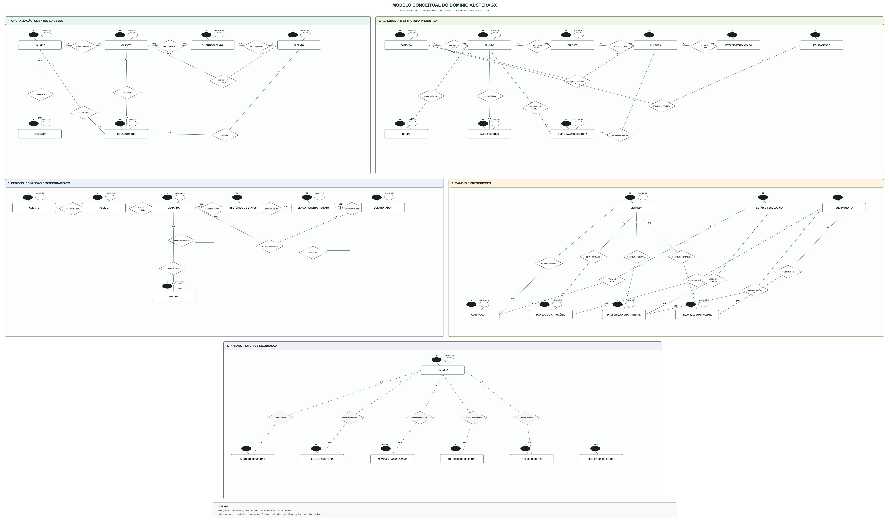
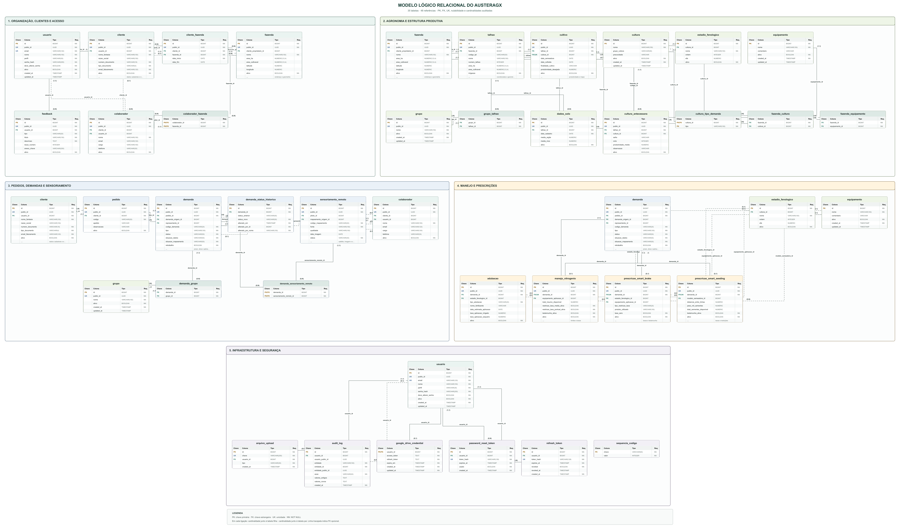
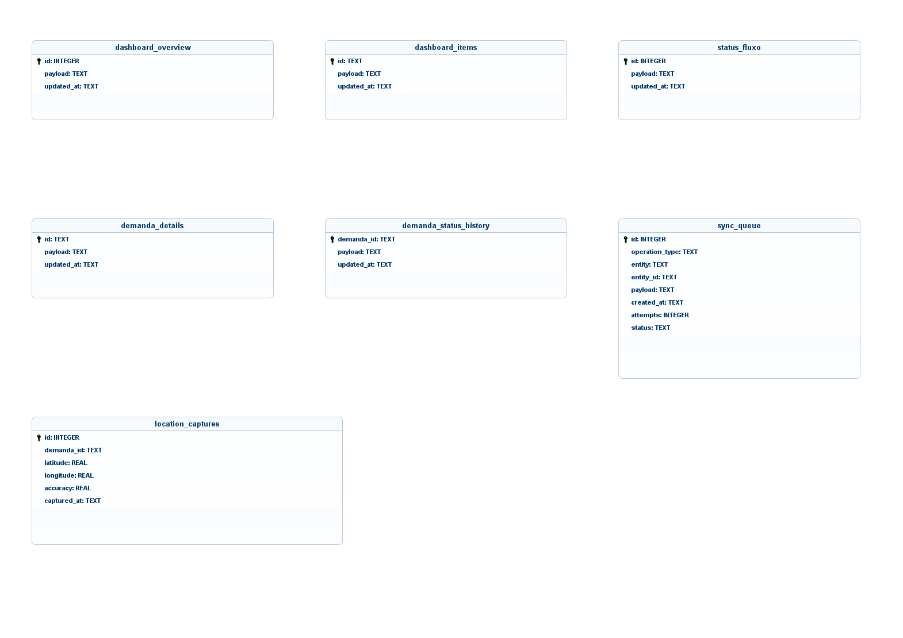

<p align="center">
  
</p>

# AusterAgX Mobile — App Android Flutter offline-first

[](https://flutter.dev/)


Aplicativo **Android em Flutter/Dart** para acompanhamento operacional de demandas agrícolas do AusterAgX. Oferece autenticação JWT, dashboard, consulta e atualização autorizada de demandas, cache SQLite isolado por usuário, fila de sincronização e captura local de GPS.

O cliente mobile reutiliza a **API AusterAgX existente**. Autorização, transições de status e validações de negócio continuam no backend oficial; o aplicativo não duplica a base transacional nem cria regras paralelas.

---

## Preview

Capturas reais dos widgets Flutter em viewport mobile de 390 × 844 pontos, usando dados controlados de demonstração.

| Dashboard operacional | Demandas por etapa e status |
|:---:|:---:|
|  |  |

<details>
<summary><strong>Ver o fluxo completo de telas</strong></summary>

<p align="center">
  
  
  
</p>

</details>

---

## Tecnologias

| Camada | Tecnologias |
|---|---|
| **Mobile** | Flutter / Dart, Material 3, internacionalização nativa do Flutter |
| **Estado e DI** | Riverpod para estado assíncrono, sessão e injeção de dependências |
| **Navegação** | GoRouter com `StatefulShellRoute.indexedStack` |
| **API** | Dio, REST, JWT com access token e refresh token rotativo |
| **Persistência** | SQLite via `sqlite3` e `sqlite3_flutter_libs`, cache por usuário e fila offline |
| **Segurança** | `flutter_secure_storage`, validação de origem da API e assinatura release obrigatória |
| **Conectividade** | `connectivity_plus`, política de falhas transitórias e sincronização automática |
| **Recursos nativos** | `geolocator` e `permission_handler` para captura GPS e permissões Android |
| **Interface** | Identidade AUSTER, logo oficial, Inter e Bebas Neue |
| **Qualidade** | `flutter_test`, Mocktail, Flutter Lints e 43 testes automatizados |
| **Modelagem** | brModelo Web, brModelo desktop e Mermaid |

---

## Principais funcionalidades

1. **Autenticação e sessão**
   - Login por e-mail e senha em `POST /auth/login`.
   - JWT armazenado no cofre seguro do sistema, nunca em preferências simples ou no SQLite.
   - Renovação coordenada de token para impedir múltiplos refreshes concorrentes.
   - Logout com revogação do refresh token no backend.
   - Restauração offline somente depois de uma sessão validada anteriormente.

2. **Troca obrigatória de senha**
   - Bloqueio da navegação operacional quando `deveAlterarSenha = true`.
   - Envio do contrato oficial para `POST /auth/change-password`.
   - Atualização imediata da sessão após a confirmação da nova senha.

3. **Dashboard operacional**
   - Resumo de clientes, fazendas, talhões e vínculos.
   - Métricas de área e cobertura por talhões.
   - Maiores fazendas e demandas recentes.
   - Mesmos agrupamentos operacionais usados pelo painel AusterAgX.

4. **Demandas**
   - Listagem agrupada em `Listada`, `A seguir`, `Coleta de dados`, `Andamento`, `Entregue` e `Cancelada`.
   - Detalhe agregado com pedido, cliente, fazendas, grupos, talhões, culturas e sensoriamentos.
   - Histórico de status, demanda de origem e demandas derivadas.
   - Atualização de status, situação dos dados e situação do mapeamento para perfis autorizados.

5. **Operação offline**
   - Cache local de dashboard, lista, detalhe, histórico e regras de transição.
   - Leitura local quando não há conectividade ou ocorre falha HTTP transitória.
   - Um arquivo SQLite por usuário, identificado por hash, para impedir exposição entre contas.
   - Erros definitivos de autorização ou contrato permanecem visíveis e não são mascarados pelo cache.

6. **Fila de sincronização**
   - Escritas offline otimistas com indicador global de estado.
   - Consolidação da última alteração pendente por demanda.
   - Reconciliação dos caches com a resposta oficial após um `PATCH` aceito.
   - Repetição de falhas transitórias e bloqueio de rejeições permanentes para evitar loops.

7. **Recurso nativo de GPS**
   - Captura de latitude, longitude, precisão e horário no detalhe da demanda.
   - Permissão solicitada em tempo de execução.
   - Registro mantido localmente, pois a API atual não oferece endpoint de demanda para esse payload.

8. **Segurança e mensagens de erro**
   - Diferencia sessão expirada, acesso negado, validação, indisponibilidade, timeout e limite de requisições.
   - Não expõe stack traces ou detalhes internos do servidor ao usuário.
   - HTTP local liberado apenas em debug; release exige HTTPS por padrão.

9. **Identidade visual AUSTER**
   - Logo bicolor oficial, azul `#0261BD` e verde `#00B37B`.
   - Bebas Neue nos títulos e Inter no restante da interface.
   - Launcher Android gerado a partir do símbolo oficial.

---

## Perfis de acesso

| Perfil | Comportamento no aplicativo |
|---|---|
| `SUPER_ADMIN` | Consulta e alteração operacional de demandas |
| `USUARIO_TECNICO_PRESCRICAO` | Consulta e alteração operacional de demandas |
| `USUARIO_CONSULTOR_CTV` | Consulta conforme a carteira autorizada pelo backend |
| `USUARIO_ASSISTENTE_ATV` | Consulta conforme a autorização recebida da API |
| `USUARIO_GESTOR_ADMINISTRATIVO` | Consulta conforme a autorização recebida da API |

Somente `SUPER_ADMIN` e `USUARIO_TECNICO_PRESCRICAO` recebem ações de alteração de status, dados e mapeamento. A API continua sendo a autoridade final: ausência de autenticação resulta em `401` e falta de permissão em `403`.

---

## Arquitetura

A organização separa infraestrutura técnica, contratos de dados, regras de acesso, estado de interface e funcionalidades. O fluxo principal é **tela → provider/controller → repositório → API e SQLite**.

```text
lib/
  app/                         configuração do aplicativo
  routes/                      navegação e proteção de rotas
  core/
    auth/                      eventos e perfis da sessão
    config/                    configuração por dart-define
    errors/                    erros de domínio e mensagens seguras
    network/                   conectividade e política de falhas
  data/
    local/                     SQLite e isolamento por usuário
    models/                    DTOs e modelos imutáveis
    repositorios/              coordenação API/cache
    services/                  clientes REST, tokens, GPS e usuário
    sync/                      fila e serviço de sincronização
  features/
    authentication/            login e troca de senha
    dashboard/                 visão geral operacional
    demandas/                  lista e detalhe
    location/                  captura de localização
    shell/                     navegação principal
  widgets/                     componentes AUSTER compartilhados
```

O shell usa `StatefulShellRoute.indexedStack` para manter pilhas independentes entre Dashboard e Demandas. A barra global de sincronização fica em `lib/widgets/sync_status_bar.dart`.

O aplicativo consome `/demandas/status-fluxo` para obter transições e pré-requisitos. Dessa forma, a ordem do processo não é codificada novamente no cliente.

---

## Modelagem do banco de dados

Os dados são documentados em três camadas para separar o domínio da API, sua implementação relacional e a estratégia de cache offline do aplicativo. A auditoria foi feita sobre JPA e Flyway sem alterar o backend oficial.

### Modelo conceitual do domínio AusterAgX

Derivado do [diagrama de classes](docs/diagrama-classes.md), o modelo representa **28 entidades persistentes**, **36 associações JPA** e **5 relacionamentos físicos adicionais** encontrados nas migrations, totalizando **41 relacionamentos auditados**. A vista segue a notação de Chen usada pelo [brModelo Web](https://app.brmodeloweb.com/main), com entidades, relacionamentos, chaves e cardinalidades mínimas/máximas.

[](docs/modelo-er/auster-agx-conceitual.png)

**Artefatos:** [catálogo semântico](docs/modelo-er/auster-agx-dominio.md) · [matriz de cardinalidades](docs/modelo-er/auster-agx-cardinalidades.md) · [grafo JointJS para o brModelo Web](docs/modelo-er/auster-agx-brmodelo-web.json) · [DOT](docs/modelo-er/auster-agx-conceitual.dot) · [SVG](docs/modelo-er/auster-agx-conceitual.svg) · [PNG](docs/modelo-er/auster-agx-conceitual.png)

### Modelo lógico relacional do backend

O modelo lógico explicita **35 tabelas**, **48 referências por FK** e **7 estruturas associativas ou de coleção**. Cada tabela destaca PK, FK, UK e `NOT NULL`; as linhas trazem a coluna de vínculo e as cardinalidades. Restrições ausentes nas migrations, como PK composta em `demanda_grupo`, não foram inventadas.

[](docs/modelo-er/auster-agx-logico.png)

**Artefatos:** [DOT](docs/modelo-er/auster-agx-logico.dot) · [SVG](docs/modelo-er/auster-agx-logico.svg) · [PNG](docs/modelo-er/auster-agx-logico.png) · [índice da modelagem](docs/modelo-er/README.md)

### Modelo físico do cache SQLite

O terceiro modelo reproduz as sete tabelas de `lib/data/local/app_database.dart`, incluindo tipos, chaves primárias, nulabilidade, valores padrão, `CHECK` e `AUTOINCREMENT`.

[](docs/modelo-er/auster-agx-mobile-fisico.png)

**Artefatos:** [brModelo `.brM3`](docs/modelo-er/auster-agx-mobile-fisico.brM3) · [XML](docs/modelo-er/auster-agx-mobile-fisico.xml) · [PNG](docs/modelo-er/auster-agx-mobile-fisico.png)

| Conceito | Persistência física offline |
|---|---|
| Resumo de demanda | `dashboard_items.payload`, um JSON por demanda |
| Detalhe de demanda | `demanda_details.payload`, um JSON por demanda |
| Histórico de status | `demanda_status_history.payload`, lista JSON por `demanda_id` |
| Operação de sincronização | Uma linha em `sync_queue`, identificada por entidade e ID |
| Captura de localização | Uma linha em `location_captures`, associada por `demanda_id` |
| Resumo do dashboard | Snapshot único em `dashboard_overview` |
| Regras de transição | Snapshot único em `status_fluxo` |

O cache não declara `FOREIGN KEY`: os vínculos locais são lógicos e os payloads preservam o contrato da API. Tokens e o último perfil autenticado ficam no `flutter_secure_storage`, fora do SQLite.

---

## Como rodar

> O passo a passo completo para Windows, emulador, celular físico, APK e assinatura está em [INSTALACAO.md](INSTALACAO.md).

### Preparação

```powershell
git clone https://github.com/Joloano/auster-agx-mobile.git
cd auster-agx-mobile
flutter pub get
```

### App mobile no emulador Android

```powershell
flutter run --dart-define=API_BASE_URL=http://10.0.2.2:8080
```

### App mobile em celular físico

```powershell
flutter devices
flutter run -d ID_DO_DISPOSITIVO --dart-define=API_BASE_URL=http://IP_DO_COMPUTADOR:8080
```

Computador, celular e API devem estar na mesma rede. `10.0.2.2` funciona apenas no emulador Android.

### Configuração da API

| Opção | Descrição |
|---|---|
| `API_BASE_URL` | Origem HTTP(S) do backend; padrão `http://10.0.2.2:8080` |
| `API_TIMEOUT_MS` | Timeout HTTP em milissegundos; padrão `10000` |
| `ALLOW_INSECURE_HTTP` | `true` em debug e `false` em release por padrão |

O valor de `API_BASE_URL` deve ser uma origem sem caminho, query, fragmento ou credenciais. O app não inclui usuários de demonstração: use uma conta válida do ambiente AusterAgX. Se a senha for provisória, a troca será exigida automaticamente.

### APK de desenvolvimento

```powershell
flutter build apk --debug --dart-define=API_BASE_URL=http://IP_DO_COMPUTADOR:8080
adb install -r build\app\outputs\flutter-apk\app-debug.apk
```

### Distribuição

Builds release exigem HTTPS e assinatura privada configurada. Consulte [a seção de assinatura do guia](INSTALACAO.md#configurar-assinatura-de-produção) antes de gerar APK ou Android App Bundle.

---

## Documentação técnica

- **Instalação, emulador, celular e assinatura:** [INSTALACAO.md](INSTALACAO.md)
- **Endpoints, DTOs, autorização e regras do backend:** [docs/investigacao-api.md](docs/investigacao-api.md)
- **Diagrama de classes do domínio:** [docs/diagrama-classes.md](docs/diagrama-classes.md)
- **Modelagem conceitual, lógica e física:** [docs/modelo-er/README.md](docs/modelo-er/README.md)
- **Decisões de segurança da primeira fase:** [docs/fase-1-seguranca.md](docs/fase-1-seguranca.md)
- **Configuração e permissões Android:** [docs/android-config.md](docs/android-config.md)
- **Issues acadêmicas versionadas:** [docs/issues/README.md](docs/issues/README.md)
- **Issues do repositório:** [GitHub Issues](https://github.com/Joloano/auster-agx-mobile/issues)

---

## Testes automatizados

Baseline validada em **20 de setembro de 2026**:

- `flutter analyze --no-pub`: **nenhuma ocorrência**.
- `flutter test --no-pub`: **43 testes aprovados**.

```powershell
flutter analyze
flutter test
```

A suíte cobre configuração segura da API, SQLite, isolamento de usuário, fila offline, tradução de erros, refresh JWT, sincronização, repositórios, mapeamento dos DTOs reais e proteção das rotas/widgets de autenticação.

---

## Demonstração acadêmica

1. Abrir o aplicativo.
2. Autenticar pela API REST e receber JWT.
3. Trocar a senha quando o backend marcar a credencial como provisória.
4. Consultar dashboard e demandas.
5. Abrir o detalhe agregado de uma demanda.
6. Desligar a internet e continuar consultando os dados locais.
7. Alterar status, dados ou mapeamento com um perfil autorizado.
8. Conferir a operação pendente e o estado otimista no app.
9. Restabelecer a conexão e sincronizar com o servidor.
10. Capturar a localização GPS no detalhe da demanda.

---

## Estrutura do repositório

```text
android/          projeto, permissões, ícones e assinatura Android
assets/           logo oficial e fontes AUSTER
docs/             contratos, segurança, issues, diagramas e screenshots
lib/              código Dart do aplicativo
scripts/          automação de publicação e criação de issues
test/             testes unitários e de widgets
.env.example      referência das opções locais de API
INSTALACAO.md     guia completo de ambiente e execução
README.md         apresentação e documentação principal
pubspec.yaml      dependências, assets e metadados Flutter
```

Como este repositório é exclusivamente mobile, o projeto Flutter permanece na raiz. Backend e banco transacional não são copiados para pastas locais: o aplicativo consome a API AusterAgX já mantida pelo sistema oficial.

---

## Segurança e integridade

- O mobile não altera tabelas, migrations ou regras do AusterAgX oficial.
- DTOs enviados respeitam os contratos aceitos por `/auth`, `/dashboard` e `/demandas`.
- Transições são obtidas de `/demandas/status-fluxo` e novamente validadas pelo servidor.
- Tokens e perfil mínimo ficam no armazenamento seguro do sistema.
- Bancos, filas e capturas GPS são isolados por usuário no dispositivo.
- Segredos de assinatura, bancos locais e arquivos `.env` não entram no Git.
- Builds release falham quando a assinatura privada não está configurada.
