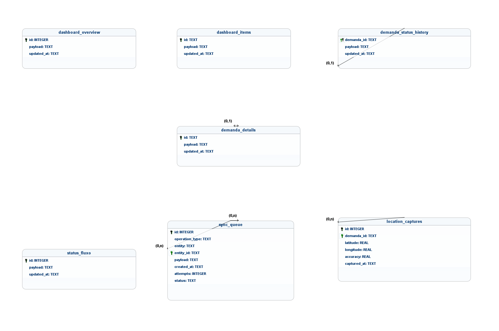
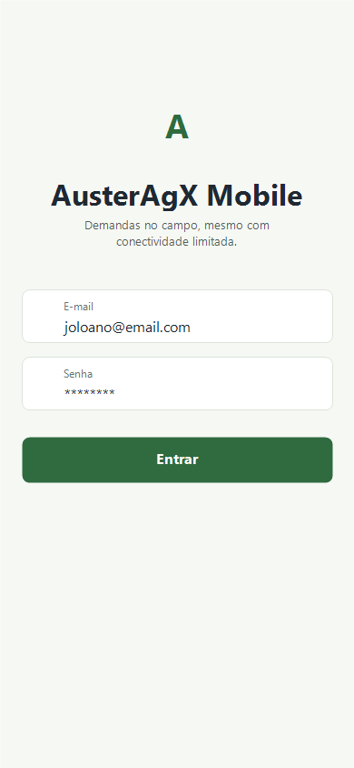
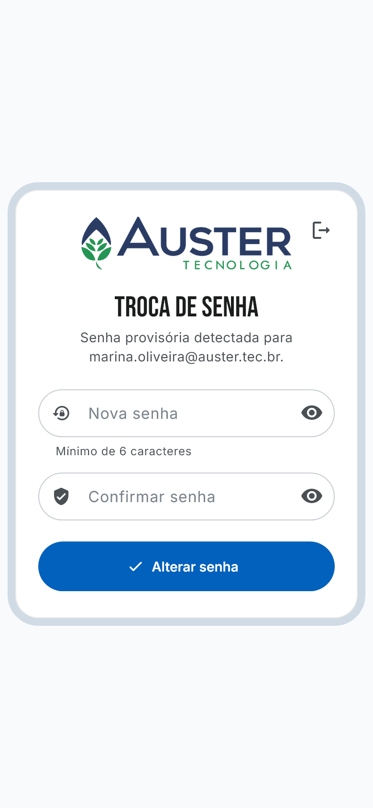
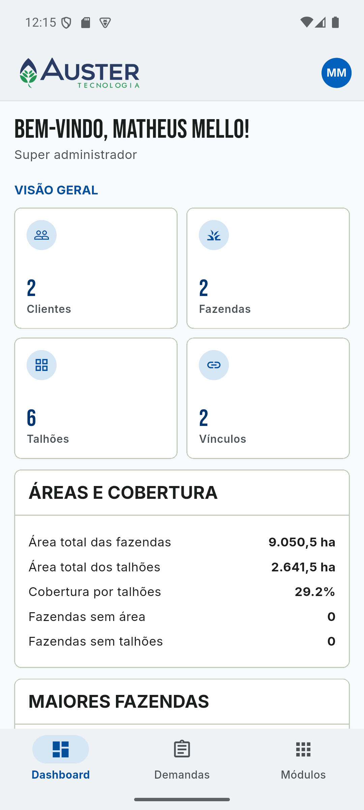
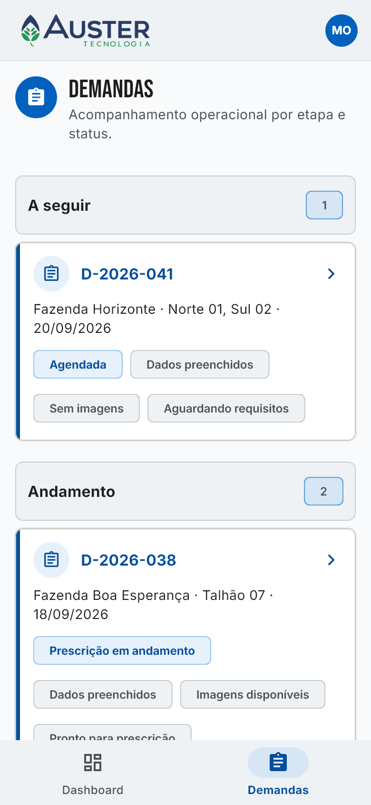
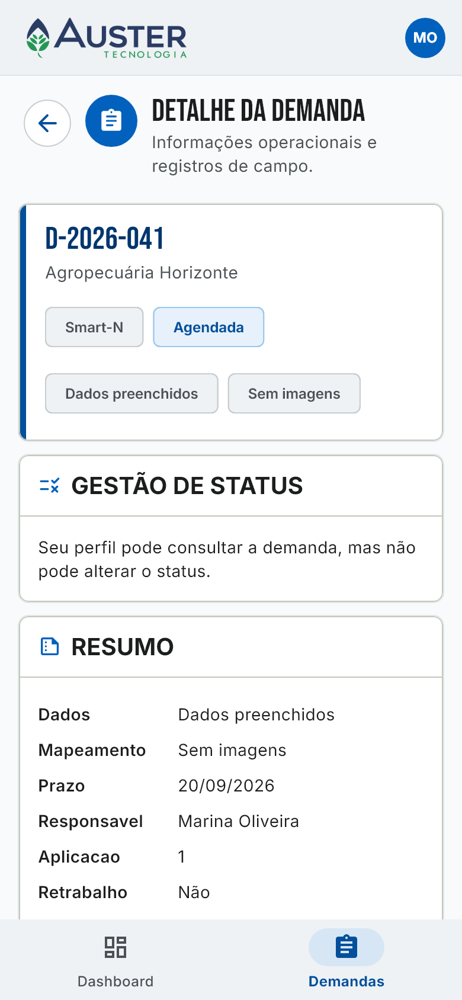

# AusterAgX Mobile

## Objetivo

Aplicativo Flutter acadêmico para acompanhamento mobile de demandas do AusterAgX, com login REST, JWT, troca obrigatória de senha temporária, armazenamento offline, fila de sincronização e captura de GPS.

## Motivação para versão mobile

Colaboradores podem consultar e atualizar demandas fora do computador, inclusive em áreas com conectividade limitada. O app prioriza o fluxo de demandas, não a conversão completa do ERP.

## Arquitetura

A organização segue o padrão do projeto de referência `gestao-riscos-mobile`, separando base técnica, camada de dados, telas por feature, rotas e widgets compartilhados:

```text
lib/
  app/
  routes/
  core/
    config/
    errors/
    network/
  data/
    local/
    models/
    repositorios/
    services/
    sync/
  features/
    authentication/
    dashboard/
    demandas/
    location/
    shell/
  widgets/
```

O shell usa `StatefulShellRoute.indexedStack`, como no app de referência, para manter pilhas independentes entre Dashboard e Demandas. A barra global de sincronização fica em `widgets/sync_status_bar.dart`.

O comportamento de demandas foi alinhado ao AusterAgX oficial: o mobile usa os mesmos endpoints REST, o mesmo contrato de DTOs, os mesmos grupos operacionais do painel e as mesmas regras de transição vindas de `/demandas/status-fluxo`.

## Identidade visual AUSTER

A interface reutiliza o logo bicolor oficial do AUSTER em `assets/branding/auster-logo-bicolor.png`, além das cores institucionais azul (`#0261BD`) e verde (`#00B37B`). Títulos usam Bebas Neue e os demais textos usam Inter, acompanhando o frontend oficial. Login, troca de senha, cabeçalho, navegação, dashboard, demandas e detalhes compartilham os mesmos componentes de identidade visual.

## Modelo ER mobile/offline

O diagrama abaixo é uma exportação real do modelo lógico criado no [brModelo desktop](https://github.com/chcandido/brModelo), e não uma aproximação em Mermaid. Os arquivos `.brM3` e XML foram reabertos e validados pelo motor do brModelo 3.x após a geração.

**Arquivos do modelo:** [editar no brModelo (`.brM3`)](docs/modelo-er/auster-agx-mobile.brM3) · [fonte XML do brModelo](docs/modelo-er/auster-agx-mobile.xml) · [imagem em alta resolução](docs/modelo-er/auster-agx-mobile.png)

<p align="center">
  
</p>

O modelo representa exatamente as tabelas criadas em `lib/data/local/app_database.dart`: `dashboard_overview`, `dashboard_items`, `demanda_details`, `demanda_status_history`, `status_fluxo`, `sync_queue` e `location_captures`. As ligações documentam as associações lógicas entre a lista de demandas, o detalhe agregado, o histórico, as capturas de campo e a fila de sincronização.

Os payloads completos recebidos da API são armazenados como JSON para preservar o contrato do backend oficial e permitir evolução sem duplicar o esquema transacional do ERP. As associações não criam chaves estrangeiras no SQLite, evitando que uma atualização parcial de cache bloqueie a operação offline.

Credenciais e tokens não aparecem no modelo porque não são persistidos no SQLite: eles permanecem no `flutter_secure_storage`. O usuário autenticado e os objetos internos de demanda são modelos de domínio reconstruídos a partir dos payloads da API.

## Tecnologias

- Dio: cliente HTTP e interceptors.
- Riverpod: estado assíncrono e injeção de dependências.
- GoRouter: navegação declarativa.
- flutter_secure_storage: armazenamento seguro de JWT e refresh token.
- SQLite via sqlite3: cache local e fila de sincronização.
- connectivity_plus: monitoramento de conectividade.
- geolocator e permission_handler: GPS e permissões nativas.

## Integração com API

Endpoints reais documentados em `docs/investigacao-api.md`.

## Configuração da API

Durante desenvolvimento:

- Android Emulator: `http://10.0.2.2:8080`
- Celular físico: usar o IP da máquina na rede local.

As opções são definidas em tempo de compilação por `--dart-define`:

- `API_BASE_URL`: endereço base do backend; o padrão local é `http://10.0.2.2:8080`.
- `API_TIMEOUT_MS`: timeout das chamadas HTTP em milissegundos; o padrão é `10000`.

Configurar URL com:

```powershell
flutter run --dart-define=API_BASE_URL=http://10.0.2.2:8080
```

## Autenticação

O login usa `POST /auth/login` com `email` e `senha`. A resposta contém `accessToken`, `refreshToken` e dados do usuário. Tokens ficam no armazenamento seguro, nunca em SharedPreferences.

Quando o backend retorna `deveAlterarSenha = true`, o app segue o comportamento do AUSTER oficial e bloqueia a navegação operacional até concluir `POST /auth/change-password`. O payload usa o contrato oficial (`novaSenha` e, quando aplicável, `senhaAtual`) e a resposta atualiza o usuário autenticado no estado da aplicação.

Durante a restauração da sessão, o roteador mantém uma tela neutra de carregamento. Dashboard, demandas e recursos operacionais só são montados depois da validação do usuário; links internos válidos são retomados após a autenticação.

## Funcionamento offline

Demandas sincronizadas são salvas no SQLite. A UI lê primeiro do banco local; quando existe internet, o repositório busca a API, atualiza o banco e reflete os dados.

O cache inclui dashboard, detalhes agregados, histórico de status e metadados de transição. Assim, depois da primeira sincronização, o app continua mostrando o contexto operacional mesmo sem conexão.

## Sincronização

Alterações feitas sem internet entram em `sync_queue`. Ao detectar conectividade, `SyncService` tenta enviar as operações pendentes e atualiza o cache local.

Para evitar envio redundante, a fila consolida a última operação pendente de uma mesma demanda antes da sincronização. O PATCH enviado para `/demandas/{id}` segue o contrato oficial: `tipo`, `representanteId`, `prazo`, `areaDeInteresse`, `status`, `situacaoDados`, `situacaoMapeamento` e `retrabalho`. A tela só oferece alteração de status, dados ou mapeamento para perfis administrativos (`SUPER_ADMIN` e `USUARIO_TECNICO_PRESCRICAO`), como no frontend oficial.

## Recurso nativo utilizado

GPS no detalhe da demanda. A captura funciona como evidência local de campo e fica separada do payload REST oficial para preservar o contrato atual do AUSTER.

## Como executar

Este workspace usa Flutter e Android SDK portáteis em `C:\auster-mobile-tools`, para não depender de instalação global nem tocar no sistema oficial:

```powershell
cd "C:\Users\Joloano\OneDrive\Área de Trabalho\AusterMobileFaculdade\auster_agx_mobile"

C:\auster-mobile-tools\flutter\bin\flutter.bat pub get
C:\auster-mobile-tools\flutter\bin\flutter.bat run --dart-define=API_BASE_URL=http://10.0.2.2:8080
```

Para evitar falhas do analysis server com o caminho acentuado `Área de Trabalho`, também existe um junction ASCII:

```powershell
cd C:\auster-mobile-work\auster_agx_mobile
```

## Testar em um celular Android

1. Ative as opções do desenvolvedor e a depuração USB no aparelho.
2. Conecte computador e celular à mesma rede Wi-Fi e confirme o dispositivo com `adb devices`.
3. Descubra o IPv4 do computador com `ipconfig` e garanta que o backend aceite conexões da rede local.
4. Execute substituindo `IP_DO_COMPUTADOR` e `ID_DO_DISPOSITIVO` pelos valores reais:

```powershell
C:\auster-mobile-tools\flutter\bin\flutter.bat run -d ID_DO_DISPOSITIVO --dart-define=API_BASE_URL=http://IP_DO_COMPUTADOR:8080
```

Para gerar e instalar um APK release configurado para o celular:

```powershell
C:\auster-mobile-tools\flutter\bin\flutter.bat build apk --release --dart-define=API_BASE_URL=http://IP_DO_COMPUTADOR:8080
adb install -r build\app\outputs\flutter-apk\app-release.apk
```

O APK precisa ter sido gerado com o `API_BASE_URL` acessível pelo celular; `10.0.2.2` funciona apenas no emulador Android.

## Testes

```powershell
C:\auster-mobile-tools\flutter\bin\flutter.bat analyze
C:\auster-mobile-tools\flutter\bin\flutter.bat test
```

## Publicação no GitHub

O repositório acadêmico foi publicado em:

```text
https://github.com/Joloano/auster-agx-mobile
```

Para repetir a publicação em outro remoto ou recriar as issues versionadas:

```powershell
cd C:\auster-mobile-work\auster_agx_mobile
.\scripts\publish-github.ps1 -RepositoryFullName SEU_USUARIO/auster-agx-mobile -CreateRepo -CreateIssues
```

Para publicar em um repositório já existente:

```powershell
.\scripts\publish-github.ps1 -RepositoryFullName SEU_USUARIO/auster-agx-mobile -CreateIssues
```

## Demonstracao

1. Abrir app.
2. Login via API REST.
3. Receber JWT.
4. Trocar senha provisória quando `deveAlterarSenha` estiver ativo.
5. Ver dashboard/demandas.
6. Desligar internet.
7. Continuar vendo dados locais.
8. Alterar status, situação dos dados ou situação do mapeamento quando o perfil permitir.
9. Ver alteração pendente consolidada e card local atualizado.
10. Religar internet.
11. Sincronizar com o servidor.
12. Abrir detalhe com resumo, contexto, sensoriamento, cadeia e histórico.
13. Capturar GPS.

## Prints das telas

Capturas reais dos widgets Flutter, renderizadas em viewport mobile de 390 x 844 pontos com dados controlados de demonstração:

<p>
  
  
  
  
  
</p>

## Entrega consolidada

- Login, refresh token, logout e troca obrigatória de senha temporária conforme o AUSTER oficial.
- Dashboard mobile com resumo operacional, cards de demandas, grupos de status e métricas de área.
- Lista e detalhe de demandas com cache offline, histórico de status, sensoriamentos, culturas e cadeia origem/derivadas.
- Atualização de status, situação dos dados e situação do mapeamento com as mesmas regras de transição do backend.
- Fila offline persistente, consolidada por demanda, com sincronização automática quando a conexão volta.
- Captura GPS local no detalhe da demanda usando permissões nativas Android.
- README, modelo ER do brModelo, investigação de API, issues versionadas e prints mobile mantidos no próprio repositório.

## Limitações conhecidas

- A localização GPS permanece no banco local porque o AUSTER oficial não possui um endpoint específico para associá-la à demanda. O backend não foi alterado nem recebeu campos inventados.
- A estratégia de conflito offline consolida a última alteração pendente por demanda. Mesclagem distribuída e versionamento de registros exigiriam suporte contratual do servidor.
- A entrega foi validada no Android. Uma publicação iOS ainda exige configuração, assinatura e validação em ambiente Apple.

## Possíveis melhorias

- Sincronizar capturas GPS quando existir um endpoint oficial aprovado para esse contrato.
- Adicionar testes de integração contra um ambiente controlado do backend e uma suíte automatizada em dispositivo físico.
- Criar pipelines de assinatura, distribuição interna e validação também para iOS.
- Avaliar sincronização periódica em segundo plano após definir requisitos de bateria, rede e política operacional.

## Premissas de integridade do AUSTER oficial

- O app mobile consome endpoints REST existentes e não altera tabelas, migrations ou regras do sistema oficial.
- O payload enviado ao backend respeita os DTOs já aceitos por `/auth`, `/dashboard` e `/demandas`.
- Dados locais existem para operação mobile/offline e não substituem a base transacional do AUSTER.
- O build validado é Android, usando Flutter e Android SDK portáteis em `C:\auster-mobile-tools`.
