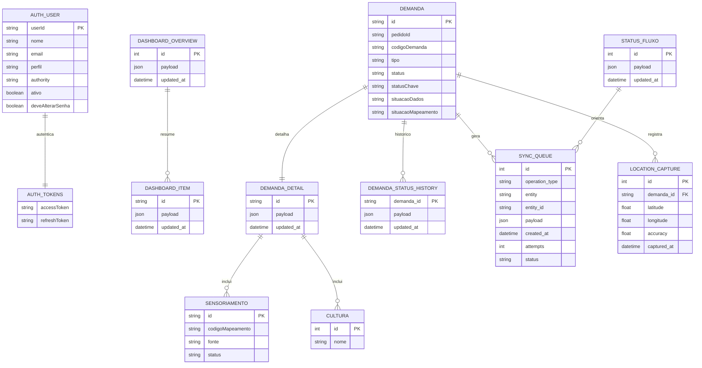

# AusterAgX Mobile

## Objetivo

Aplicativo Flutter academico para acompanhamento mobile de demandas do AusterAgX, com login REST, JWT, troca obrigatoria de senha temporaria, armazenamento offline, fila de sincronizacao e captura de GPS.

## Motivacao para versao mobile

Colaboradores podem consultar e atualizar demandas fora do computador, inclusive em areas com conectividade limitada. O app prioriza o fluxo de demandas, nao a conversao completa do ERP.

## Arquitetura

A organizacao segue o padrao do projeto de referencia `gestao-riscos-mobile`, separando base tecnica, camada de dados, telas por feature, rotas e widgets compartilhados:

```text
lib/
  app/
  routes/
  core/
    config/
    errors/
    network/
  data/
    local/
    models/
    repositorios/
    services/
    sync/
  features/
    authentication/
    dashboard/
    demandas/
    location/
    shell/
  widgets/
```

O shell usa `StatefulShellRoute.indexedStack`, como no app de referencia, para manter pilhas independentes entre Dashboard e Demandas. A barra global de sincronizacao fica em `widgets/sync_status_bar.dart`.

O comportamento de demandas foi alinhado ao AusterAgX oficial: o mobile usa os mesmos endpoints REST, o mesmo contrato de DTOs, os mesmos grupos operacionais do painel e as mesmas regras de transicao vindas de `/demandas/status-fluxo`.

## Modelo ER mobile/offline

O modelo local foi mantido enxuto para proteger a integridade do sistema oficial: o app mobile nao replica todo o ERP, apenas guarda o necessario para login, dashboard, demandas, fila offline e capturas de GPS. Os objetos principais da API ficam cacheados como JSON, preservando compatibilidade com o backend existente.



No SQLite, as tabelas reais sao `dashboard_overview`, `dashboard_items`, `demanda_details`, `demanda_status_history`, `status_fluxo`, `sync_queue` e `location_captures`. `AuthTokens` ficam no `flutter_secure_storage`; `AuthUser` e `Demanda` representam modelos da API usados pelo app e serializados nos payloads locais.

## Tecnologias

- Dio: cliente HTTP e interceptors.
- Riverpod: estado assíncrono e injecao de dependencias.
- GoRouter: navegacao declarativa.
- flutter_secure_storage: armazenamento seguro de JWT e refresh token.
- SQLite via sqlite3: cache local e fila de sincronizacao.
- connectivity_plus: monitoramento de conectividade.
- geolocator e permission_handler: GPS e permissoes nativas.

## Integracao com API

Endpoints reais documentados em `docs/investigacao-api.md`.

Durante desenvolvimento:

- Android Emulator: `http://10.0.2.2:8080`
- Celular fisico: usar o IP da maquina na rede local.

Configurar URL com:

```powershell
flutter run --dart-define=API_BASE_URL=http://10.0.2.2:8080
```

## Autenticacao

O login usa `POST /auth/login` com `email` e `senha`. A resposta contem `accessToken`, `refreshToken` e dados do usuario. Tokens ficam no armazenamento seguro, nunca em SharedPreferences.

Quando o backend retorna `deveAlterarSenha = true`, o app segue o comportamento do AUSTER oficial e bloqueia a navegacao operacional ate concluir `POST /auth/change-password`. O payload usa o contrato oficial (`novaSenha` e, quando aplicavel, `senhaAtual`) e a resposta atualiza o usuario autenticado no estado da aplicacao.

Durante a restauracao da sessao, o roteador mantem uma tela neutra de carregamento. Dashboard, demandas e plugins operacionais so sao montados depois da validacao do usuario; links internos validos sao retomados apos a autenticacao.

## Funcionamento offline

Demandas sincronizadas sao salvas no SQLite. A UI le primeiro do banco local; quando existe internet, o repositorio busca a API, atualiza o banco e reflete os dados.

O cache inclui dashboard, detalhes agregados, historico de status e metadados de transicao. Assim, depois da primeira sincronizacao, o app continua mostrando o contexto operacional mesmo sem conexao.

## Sincronizacao

Alteracoes feitas sem internet entram em `sync_queue`. Ao detectar conectividade, `SyncService` tenta enviar as operacoes pendentes e atualiza o cache local.

Para evitar envio redundante, a fila consolida a ultima operacao pendente de uma mesma demanda antes da sincronizacao. O PATCH enviado para `/demandas/{id}` segue o contrato oficial: `tipo`, `representanteId`, `prazo`, `areaDeInteresse`, `status`, `situacaoDados`, `situacaoMapeamento` e `retrabalho`. A tela so oferece alteracao de status/dados/mapeamento para perfis administrativos (`SUPER_ADMIN` e `USUARIO_TECNICO_PRESCRICAO`), como no frontend oficial.

## Recurso nativo utilizado

GPS no detalhe da demanda. A captura funciona como evidencia local de campo e fica separada do payload REST oficial para preservar o contrato atual do AUSTER.

## Como executar

Este workspace usa Flutter e Android SDK portateis em `C:\auster-mobile-tools`, para nao depender de instalacao global nem tocar no sistema oficial:

```powershell
cd "C:\Users\Joloano\OneDrive\Área de Trabalho\AusterMobileFaculdade\auster_agx_mobile"

C:\auster-mobile-tools\flutter\bin\flutter.bat pub get
C:\auster-mobile-tools\flutter\bin\flutter.bat run --dart-define=API_BASE_URL=http://10.0.2.2:8080
```

Para evitar falhas do analysis server com o caminho acentuado `Área de Trabalho`, tambem existe um junction ASCII:

```powershell
cd C:\auster-mobile-work\auster_agx_mobile
```

## Testes

```powershell
C:\auster-mobile-tools\flutter\bin\flutter.bat analyze
C:\auster-mobile-tools\flutter\bin\flutter.bat test
```

## Publicacao no GitHub

O repositorio academico foi publicado como privado em:

```text
https://github.com/Joloano/auster-agx-mobile
```

Para repetir a publicacao em outro remoto ou recriar as issues versionadas:

```powershell
cd C:\auster-mobile-work\auster_agx_mobile
.\scripts\publish-github.ps1 -RepositoryFullName SEU_USUARIO/auster-agx-mobile -CreateRepo -CreateIssues
```

Para publicar em um repositorio ja existente:

```powershell
.\scripts\publish-github.ps1 -RepositoryFullName SEU_USUARIO/auster-agx-mobile -CreateIssues
```

## Demonstracao

1. Abrir app.
2. Login via API REST.
3. Receber JWT.
4. Trocar senha provisoria quando `deveAlterarSenha` estiver ativo.
5. Ver dashboard/demandas.
6. Desligar internet.
7. Continuar vendo dados locais.
8. Alterar status, situacao dos dados ou situacao do mapeamento quando o perfil permitir.
9. Ver alteracao pendente consolidada e card local atualizado.
10. Religar internet.
11. Sincronizar com servidor.
12. Abrir detalhe com resumo, contexto, sensoriamento, cadeia e historico.
13. Capturar GPS.

## Prints das telas

Prints demonstrativos das principais telas mobile com dados de exemplo:

<p>
  
  
  
  
  
</p>

## Entrega consolidada

- Login, refresh token, logout e troca obrigatoria de senha temporaria conforme o AUSTER oficial.
- Dashboard mobile com resumo operacional, cards de demandas, grupos de status e metricas de area.
- Lista e detalhe de demandas com cache offline, historico de status, sensoriamentos, culturas e cadeia origem/derivadas.
- Atualizacao de status, situacao dos dados e situacao do mapeamento com as mesmas regras de transicao do backend.
- Fila offline persistente, consolidada por demanda, com sincronizacao automatica quando a conexao volta.
- Captura GPS local no detalhe da demanda usando permissoes nativas Android.
- README, modelo ER, investigacao de API, issues versionadas e prints mobile mantidos no proprio repositorio.

## Premissas de integridade do AUSTER oficial

- O app mobile consome endpoints REST existentes e nao altera tabelas, migrations ou regras do sistema oficial.
- O payload enviado ao backend respeita os DTOs ja aceitos por `/auth`, `/dashboard` e `/demandas`.
- Dados locais existem para operacao mobile/offline e nao substituem a base transacional do AUSTER.
- O build validado e Android, usando Flutter e Android SDK portateis em `C:\auster-mobile-tools`.
