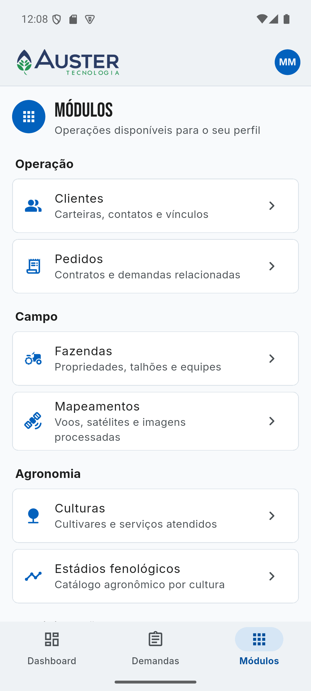
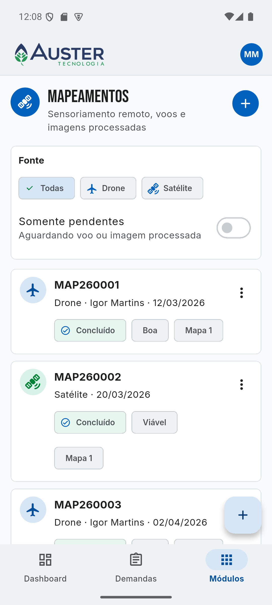
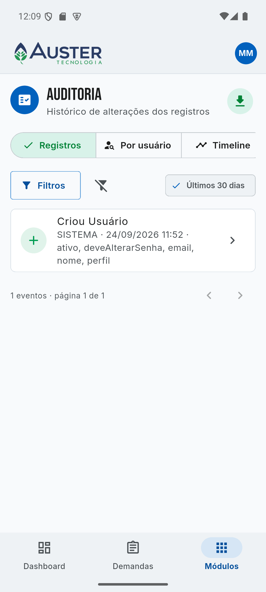
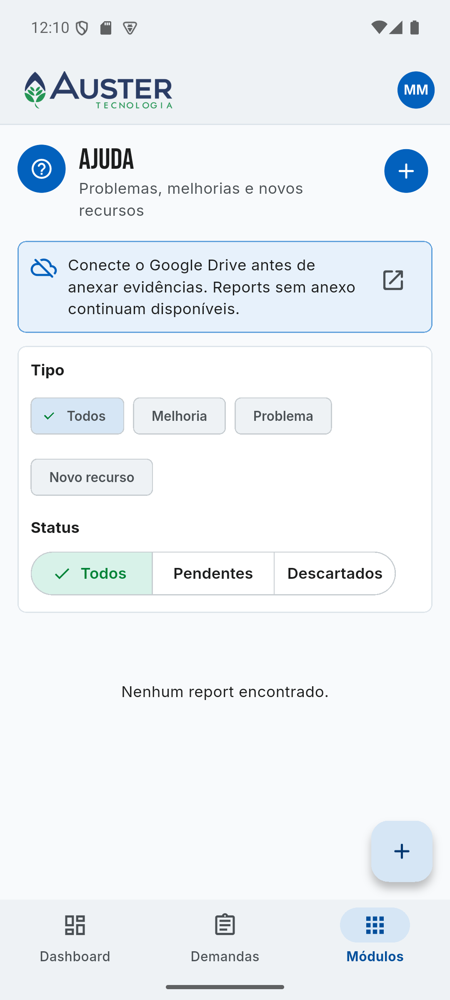
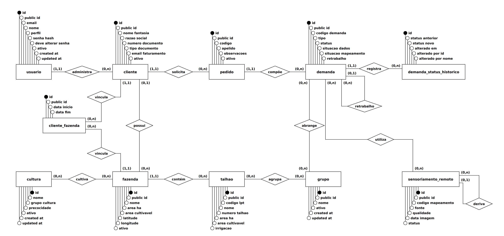
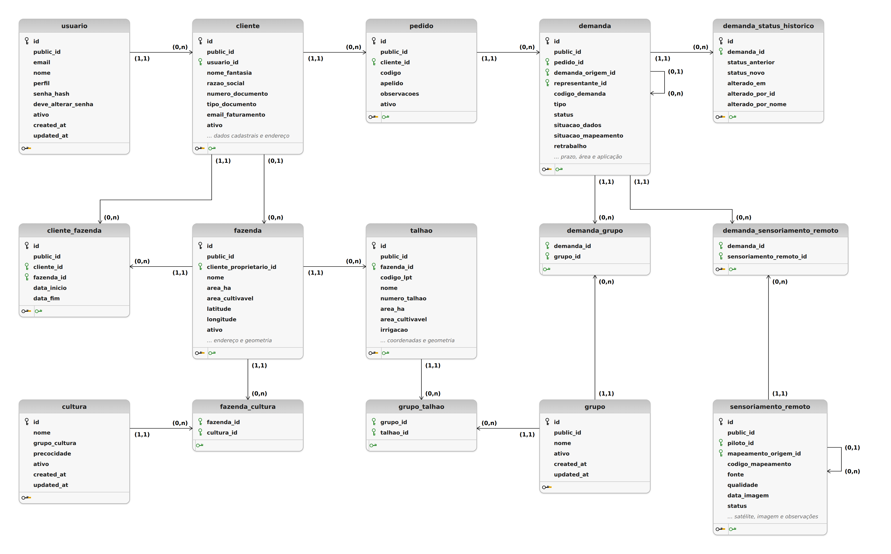

<p align="center">
  
</p>

# AusterAgX Mobile — App Android Flutter offline-first

[](https://flutter.dev/)


[](https://github.com/Joloano/auster-agx-mobile/actions/workflows/ci.yml)

[](LICENSE)

Aplicativo **Android em Flutter/Dart** para a operação do AusterAgX. Reúne autenticação, dashboard, demandas, clientes, fazendas, talhões, pedidos, gestão agronômica, mapeamentos, auditoria e suporte, além de cache SQLite isolado por usuário, fila de sincronização e captura local de GPS.

O cliente mobile reutiliza a **API AusterAgX existente**. Autorização, transições de status e validações de negócio continuam no backend oficial; o aplicativo não duplica a base transacional nem cria regras paralelas.

---

## Sumário

- [Preview](#preview)
- [Tecnologias](#tecnologias)
- [Principais funcionalidades](#principais-funcionalidades)
- [Perfis de acesso](#perfis-de-acesso)
- [Arquitetura](#arquitetura)
- [Modelagem do banco de dados](#modelagem-do-banco-de-dados)
- [Pré-requisitos](#pré-requisitos)
- [Como rodar](#como-rodar)
- [Documentação técnica](#documentação-técnica)
- [Testes automatizados](#testes-automatizados)
- [Demonstração acadêmica](#demonstração-acadêmica)
- [Estrutura do repositório](#estrutura-do-repositório)
- [Segurança e integridade](#segurança-e-integridade)
- [Licença e autoria](#licença-e-autoria)

---

## Preview

Capturas reais da build Android executada em um Pixel 8 (1080 × 2400), conectada à API e à massa local de demonstração.

| Dashboard operacional | Módulos por perfil |
|:---:|:---:|
|  |  |

| Mapeamentos | Auditoria |
|:---:|:---:|
|  |  |

<details>
<summary><strong>Ver o fluxo completo de telas</strong></summary>

<p align="center">
  
  
  
  
</p>

</details>

---

## Tecnologias

| Camada | Tecnologias |
|---|---|
| **Mobile** | Flutter / Dart, Material 3, internacionalização nativa do Flutter |
| **Estado e DI** | Riverpod para estado assíncrono, sessão e injeção de dependências |
| **Navegação** | GoRouter com `StatefulShellRoute.indexedStack` |
| **API** | Dio, REST, JWT com access token e refresh token rotativo |
| **Persistência** | SQLite via `sqlite3` e `sqlite3_flutter_libs`, cache por usuário e fila offline |
| **Segurança** | `flutter_secure_storage`, validação de origem da API e assinatura release obrigatória |
| **Conectividade** | `connectivity_plus`, política de falhas transitórias e sincronização automática |
| **Recursos nativos** | `geolocator`, `permission_handler`, `file_picker` e `url_launcher` para GPS, permissões, anexos e integrações Android |
| **Interface** | Identidade AUSTER, logo oficial, Inter e Bebas Neue |
| **Qualidade** | `flutter_test`, Mocktail, Flutter Lints, 74 testes automatizados e CI no GitHub Actions |
| **Modelagem** | brModelo Web, brModelo desktop e Mermaid |
| **Ambiente** | Docker Compose (Postgres/PostGIS, API AusterAgX e massa de teste) e scripts PowerShell |

---

## Principais funcionalidades

1. **Autenticação e sessão**
   - Login por e-mail e senha em `POST /auth/login`.
   - JWT armazenado no cofre seguro do sistema, nunca em preferências simples ou no SQLite.
   - Renovação coordenada de token para impedir múltiplos refreshes concorrentes.
   - Logout com revogação do refresh token no backend.
   - Restauração offline somente depois de uma sessão validada anteriormente.
   - Recuperação e redefinição de senha com resposta neutra para não revelar contas cadastradas.
   - Edição do próprio perfil com substituição atômica do JWT quando o e-mail muda.

2. **Troca obrigatória de senha**
   - Bloqueio da navegação operacional quando `deveAlterarSenha = true`.
   - Envio do contrato oficial para `POST /auth/change-password`.
   - Atualização imediata da sessão após a confirmação da nova senha.

3. **Dashboard operacional**
   - Resumo de clientes, fazendas, talhões e vínculos.
   - Métricas de área e cobertura por talhões.
   - Maiores fazendas e demandas recentes.
   - Mesmos agrupamentos operacionais usados pelo painel AusterAgX.

4. **Demandas**
   - Listagem agrupada em `Listada`, `A seguir`, `Coleta de dados`, `Andamento`, `Entregue` e `Cancelada`.
   - Detalhe agregado com pedido, cliente, fazendas, grupos, talhões, culturas e sensoriamentos.
   - Histórico de status, demanda de origem e demandas derivadas.
   - Atualização de status, situação dos dados e situação do mapeamento para perfis autorizados.

5. **Operação offline**
   - Cache local de dashboard, lista, detalhe, histórico e regras de transição.
   - Leitura local quando não há conectividade ou ocorre falha HTTP transitória.
   - Um arquivo SQLite por usuário, identificado por hash, para impedir exposição entre contas.
   - Erros definitivos de autorização ou contrato permanecem visíveis e não são mascarados pelo cache.

6. **Fila de sincronização**
   - Escritas offline otimistas com indicador global de estado.
   - Consolidação da última alteração pendente por demanda.
   - Reconciliação dos caches com a resposta oficial após um `PATCH` aceito.
   - Repetição de falhas transitórias e bloqueio de rejeições permanentes para evitar loops.

7. **Recurso nativo de GPS**
   - Captura de latitude, longitude, precisão e horário no detalhe da demanda.
   - Permissão solicitada em tempo de execução.
   - Registro mantido localmente, pois a API atual não oferece endpoint de demanda para esse payload.

8. **Segurança e mensagens de erro**
   - Diferencia sessão expirada, acesso negado, validação, indisponibilidade, timeout e limite de requisições.
   - Não expõe stack traces ou detalhes internos do servidor ao usuário.
   - HTTP local liberado apenas em debug; release exige HTTPS por padrão.

9. **Identidade visual AUSTER**
   - Logo bicolor oficial, azul `#0261BD` e verde `#00B37B`.
   - Bebas Neue nos títulos e Inter no restante da interface.
   - Launcher Android gerado a partir do símbolo oficial.

10. **Conta e administração**
   - Central de módulos filtrada pelo perfil autenticado.
   - Consulta, criação, edição, ativação e desativação de usuários pelo `SUPER_ADMIN`.
   - Redefinição administrativa de senha temporária e troca de senha da própria conta.

11. **Clientes e operação de campo**
   - Cadastro, edição, consulta e desativação de clientes conforme o perfil autenticado.
   - Cadastro e manutenção de fazendas e talhões com áreas, coordenadas e contorno GeoJSON.
   - Vínculos entre clientes e fazendas com data de início e encerramento.
   - Gestão de colaboradores, grupos de talhões, culturas e equipamentos associados à fazenda.
   - Paginação e pesquisa conectadas diretamente aos endpoints oficiais.

12. **Pedidos e criação de demandas**
   - Consulta, cadastro, edição e desativação de pedidos conforme as permissões da API.
   - Criação de demandas Smart-N, Smart-Brake e Smart-Seeding vinculadas ao pedido.
   - Sensoriamento inicial por drone ou satélite quando exigido pelo tipo da demanda.
   - Edição do resumo, gestão de grupos e desativação no detalhe da demanda.
   - Proteção de rotas equivalente aos perfis configurados no sistema web.

13. **Gestão agronômica**
   - Catálogos de culturas e estádios fenológicos com filtros e permissões por perfil.
   - Cultivos, culturas antecessoras e dados de solo integrados ao detalhe do talhão.
   - Adubações em taxa fixa e manejo de nitrogênio nas demandas Smart-N.
   - Prescrições completas de manejo para Smart-Brake e Smart-Seeding.
   - Leitura para perfis administrativos e escrita restrita a superadmin e técnico de prescrição.

14. **Mapeamentos, auditoria e suporte**
   - Mapeamentos por drone ou satélite com criação, remapeamento, planejamento de voo, upload, conclusão, download e desativação conforme o perfil.
   - Filtros de fonte e pendência, paginação e detalhamento integrados aos contratos oficiais de sensoriamento remoto.
   - Auditoria administrativa em registros, usuários e timeline, com período seguro de 30 dias, filtros e exportação CSV.
   - Reports de problema, melhoria e novo recurso, com evidência opcional, Google Drive e gestão administrativa de status e issue.

---

## Perfis de acesso

| Perfil | Comportamento no aplicativo |
|---|---|
| `SUPER_ADMIN` | Consulta e alteração operacional de demandas |
| `USUARIO_TECNICO_PRESCRICAO` | Consulta e alteração operacional de demandas |
| `USUARIO_CONSULTOR_CTV` | Consulta conforme a carteira autorizada pelo backend |
| `USUARIO_ASSISTENTE_ATV` | Consulta conforme a autorização recebida da API |
| `USUARIO_GESTOR_ADMINISTRATIVO` | Consulta conforme a autorização recebida da API |

Somente `SUPER_ADMIN` e `USUARIO_TECNICO_PRESCRICAO` recebem ações de alteração de status, dados e mapeamento. A API continua sendo a autoridade final: ausência de autenticação resulta em `401` e falta de permissão em `403`.

---

## Arquitetura

A organização separa infraestrutura técnica, contratos de dados, regras de acesso, estado de interface e funcionalidades. O fluxo principal é **tela → provider/controller → repositório → API e SQLite**.

```text
lib/
  app/                         configuração do aplicativo
  routes/                      navegação e proteção de rotas
  core/
    auth/                      eventos e perfis da sessão
    config/                    configuração por dart-define
    errors/                    erros de domínio e mensagens seguras
    network/                   conectividade e política de falhas
  data/
    local/                     SQLite e isolamento por usuário
    models/                    DTOs, paginação e modelos imutáveis
    repositorios/              coordenação API/cache
    services/                  clientes REST, operações, tokens, GPS e usuário
    sync/                      fila e serviço de sincronização
  features/
    authentication/            login e troca de senha
    agronomic/                 culturas, solo, adubações e prescrições
    dashboard/                 visão geral operacional
    demandas/                  lista e detalhe
    commercial/                pedidos e criação/manutenção de demandas
    location/                  captura de localização
    modules/                   permissões e composição dos módulos mobile
    rural/                     clientes, fazendas, talhões e vínculos de campo
    shell/                     navegação principal
    system/                    mapeamentos, auditoria, arquivos e suporte
  widgets/                     componentes AUSTER compartilhados
```

O shell usa `StatefulShellRoute.indexedStack` para manter pilhas independentes entre Dashboard e Demandas. A barra global de sincronização fica em `lib/widgets/sync_status_bar.dart`.

O aplicativo consome `/demandas/status-fluxo` para obter transições e pré-requisitos. Dessa forma, a ordem do processo não é codificada novamente no cliente.

---

## Modelagem do banco de dados

Modelagem conceitual e lógica na notação do **brModelo**, restrita ao subdomínio que o aplicativo consome pela API AusterAgX. Os diagramas são gerados por [`scripts/gerar-modelos-er.mjs`](scripts/gerar-modelos-er.mjs) a partir do modelo auditado sobre o mapeamento JPA e as migrations Flyway do backend.

### Modelo Conceitual (MER)

Entidades (`USUARIO`, `CLIENTE`, `CLIENTE_FAZENDA`, `FAZENDA`, `TALHAO`, `GRUPO`, `CULTURA`, `PEDIDO`, `DEMANDA`, `DEMANDA_STATUS_HISTORICO`, `SENSORIAMENTO_REMOTO`), atributos principais e cardinalidades (1:N, as N:N `fazenda × cultura`, `grupo × talhão`, `demanda × grupo` e `demanda × sensoriamento`, e os autorrelacionamentos de retrabalho e remapeamento).



### Modelo Lógico (DER)

Esquema relacional com PKs, FKs, as tabelas associativas das relações N:N (`fazenda_cultura`, `grupo_talhao`, `demanda_grupo` e `demanda_sensoriamento_remoto`) e as FKs autorreferentes `demanda_origem_id` e `mapeamento_origem_id`. As colunas `representante_id` e `piloto_id` referenciam `colaborador`, que fica fora deste recorte.



Modelo completo do domínio (28 entidades e 35 tabelas), matriz de cardinalidades e cache SQLite do aplicativo em [docs/modelo-er/README.md](docs/modelo-er/README.md).

---

## Pré-requisitos

| Requisito | Versão | Observação |
|---|---|---|
| Flutter SDK | 3.38.4 ou superior, canal stable | Desenvolvido e validado na CI com 3.47.4 |
| Dart SDK | 3.11 ou superior | Acompanha o Flutter; exigido pelas dependências do `pubspec.lock` |
| Android SDK | API 21 ou superior | Android Studio ou command-line tools |
| JDK | 17 | Exigido pelo Android Gradle Plugin |
| Node.js | 18 ou superior | Somente para regenerar os modelos ER |
| Docker Desktop | Com Docker Compose v2 | Sobe banco, API e massa de teste localmente |
| Backend AusterAgX | Cópia local de `github.com/AusterTec/AusterAgX` | Exige acesso da AusterTec; o código não é versionado aqui |

---

## Como rodar

> O passo a passo completo para Windows, emulador, celular físico, APK e assinatura está em [INSTALACAO.md](INSTALACAO.md).

### Preparação

```powershell
git clone https://github.com/Joloano/auster-agx-mobile.git
cd auster-agx-mobile
flutter pub get
```

### Ambiente completo com um comando

Com a cópia do backend em `..\AusterAgX-Mobile-Reference\backend` (ou outro caminho em `AUSTERAGX_BACKEND_DIR`, no `.env`):

```powershell
.\scripts\dev\subir-ambiente.ps1                  # banco + API + massa de teste + app no emulador
.\scripts\dev\subir-ambiente.ps1 -Alvo celular    # mesmo ambiente + APK apontando para o IP Wi-Fi
.\scripts\dev\diagnosticar-api.ps1                # confere API, login, massa de teste e dispositivos
```

Para subir só o ambiente, sem o app: `docker compose up -d --build`. A massa de teste do backend é aplicada apenas quando o banco está vazio, e a API fica em `http://localhost:8080`.

| Usuário (senha `123456`) | Perfil | No aplicativo |
|---|---|---|
| `matheus@austertec.com` | `SUPER_ADMIN` | Consulta e altera status, dados e mapeamento |
| `bruno.carvalho@austertec.com` | `USUARIO_TECNICO_PRESCRICAO` | Consulta e altera status, dados e mapeamento |
| `carla.nogueira@austertec.com` | `USUARIO_CONSULTOR_CTV` | Somente consulta |

### App mobile no emulador Android

O script usa o AVD `Pixel_8`, habilita teclado físico, WHPX, 3 GB de RAM, Quick Boot e GPU do host. Na Intel HD Graphics 620 validada, ele também persiste as flags oficiais do emulador para que a aceleração funcione ao iniciar pelo Device Manager do Android Studio.

```powershell
.\scripts\dev\subir-ambiente.ps1 -SemBuild
```

Para executar apenas o Flutter em um emulador já aberto:

```powershell
flutter run --dart-define=API_BASE_URL=http://10.0.2.2:8080
```

O teclado do computador permanece ativo com o Gboard recolhido, evitando disputa de foco. O procedimento completo para teclado, GPU e recuperação de snapshot está em [Solução de problemas](INSTALACAO.md#o-teclado-não-responde-no-emulador).

### App mobile em celular físico

```powershell
flutter devices
flutter run -d ID_DO_DISPOSITIVO --dart-define=API_BASE_URL=http://IP_DO_COMPUTADOR:8080
```

Computador, celular e API devem estar na mesma rede. `10.0.2.2` funciona apenas no emulador Android.

### Configuração da API

| Opção | Descrição |
|---|---|
| `API_BASE_URL` | Origem HTTP(S) do backend; padrão `http://10.0.2.2:8080` |
| `API_TIMEOUT_MS` | Timeout HTTP em milissegundos; padrão `30000` |
| `ALLOW_INSECURE_HTTP` | `true` em debug e `false` em release por padrão |

O valor de `API_BASE_URL` deve ser uma origem sem caminho, query, fragmento ou credenciais. O app não embarca usuários de demonstração: as contas acima vêm da massa de teste do backend. Se a senha for provisória, a troca será exigida automaticamente.

Falhas transitórias em leituras `GET`/`HEAD` recebem uma única nova tentativa automática. Escritas e sincronizações não são repetidas pelo cliente HTTP, evitando operações duplicadas; quando uma leitura ainda falhar, Dashboard, Demandas e Detalhe oferecem **Tentar novamente** sem exigir que o aplicativo seja reiniciado.

### APK de desenvolvimento

```powershell
flutter build apk --debug --dart-define=API_BASE_URL=http://IP_DO_COMPUTADOR:8080
adb install -r build\app\outputs\flutter-apk\app-debug.apk
```

### Distribuição

Builds release exigem HTTPS e assinatura privada configurada. Consulte [a seção de assinatura do guia](INSTALACAO.md#configurar-assinatura-de-produção) antes de gerar APK ou Android App Bundle.

---

## Documentação técnica

- **Instalação, emulador, celular e assinatura:** [INSTALACAO.md](INSTALACAO.md)
- **Endpoints, DTOs, autorização e regras do backend:** [docs/investigacao-api.md](docs/investigacao-api.md)
- **Diagrama de classes do domínio:** [docs/diagrama-classes.md](docs/diagrama-classes.md)
- **Modelagem conceitual, lógica e física:** [docs/modelo-er/README.md](docs/modelo-er/README.md)
- **Decisões de segurança da primeira fase:** [docs/fase-1-seguranca.md](docs/fase-1-seguranca.md)
- **Configuração e permissões Android:** [docs/android-config.md](docs/android-config.md)
- **Issues acadêmicas versionadas:** [docs/issues/README.md](docs/issues/README.md)
- **Issues do repositório:** [GitHub Issues](https://github.com/Joloano/auster-agx-mobile/issues)

---

## Testes automatizados

Baseline validada em **24 de setembro de 2026**:

- `flutter analyze --no-pub`: **nenhuma ocorrência**.
- `flutter test --no-pub`: **74 testes aprovados**.

```powershell
flutter analyze
flutter test
```

A suíte cobre configuração segura da API, SQLite, isolamento de usuário, fila offline, tradução de erros, retry seguro de leituras, rotas públicas sem bloqueio do Keystore, refresh JWT, sincronização, contratos rurais, comerciais, agronômicos e de sistema, permissões por perfil e proteção dos fluxos de autenticação.

A [CI](.github/workflows/ci.yml) roda em todo push para `main` e em pull requests: `flutter analyze`, `flutter test` e a regeneração dos modelos de dados, que falha se algum artefato de `docs/modelo-er` estiver desatualizado.

---

## Demonstração acadêmica

1. Abrir o aplicativo.
2. Autenticar pela API REST e receber JWT.
3. Trocar a senha quando o backend marcar a credencial como provisória.
4. Consultar dashboard e demandas.
5. Abrir o detalhe agregado de uma demanda.
6. Desligar a internet e continuar consultando os dados locais.
7. Alterar status, dados ou mapeamento com um perfil autorizado.
8. Conferir a operação pendente e o estado otimista no app.
9. Restabelecer a conexão e sincronizar com o servidor.
10. Capturar a localização GPS no detalhe da demanda.
11. Consultar mapeamentos, auditoria e reports pela central de módulos.

---

## Estrutura do repositório

```text
.github/workflows/    integração contínua: análise, testes e modelos em dia
android/              projeto, permissões, ícones e assinatura Android
assets/               logo oficial e fontes AUSTER
docs/                 contratos, segurança, issues, diagramas e screenshots
docs/modelo-er/       modelos conceitual, lógico e físico e seus artefatos
docs/issues/          issues do MVP versionadas junto do código
lib/                  código Dart do aplicativo
scripts/              gerador dos modelos ER e publicação do repositório
scripts/dev/          subida do ambiente local e diagnóstico da API
test/                 testes unitários e de widgets
.env.example          opções do app e do docker compose
.gitattributes        normalização de quebras de linha e arquivos binários
analysis_options.yaml regras de lint aplicadas ao código Dart
docker-compose.yml    banco, API AusterAgX e massa de teste para desenvolvimento
INSTALACAO.md         guia completo de ambiente e execução
LICENSE               licença MIT do código
NOTICE                o que fica fora da licença: marca, API e fontes
README.md             apresentação e documentação principal
pubspec.yaml          dependências, assets e metadados Flutter
```

O repositório contém um único sistema, o aplicativo, por isso o projeto Flutter fica na raiz, como gera o `flutter create`. O backend não é copiado para cá: o `docker-compose.yml` constrói a API a partir da cópia local do repositório oficial da AusterTec.

---

## Segurança e integridade

- O mobile não altera tabelas, migrations ou regras do AusterAgX oficial.
- DTOs enviados respeitam os contratos REST existentes; o aplicativo não replica validações transacionais do backend.
- Transições são obtidas de `/demandas/status-fluxo` e novamente validadas pelo servidor.
- Tokens e perfil mínimo ficam no armazenamento seguro do sistema.
- Bancos, filas e capturas GPS são isolados por usuário no dispositivo.
- Segredos de assinatura, bancos locais e arquivos `.env` não entram no Git.
- Builds release falham quando a assinatura privada não está configurada.

---

## Licença e autoria

Projeto acadêmico desenvolvido por **Joloano** ([@Joloano](https://github.com/Joloano)) no Colégio Politécnico da UFSM.

O código deste repositório é distribuído sob a [licença MIT](LICENSE). A licença cobre somente o código e a documentação escritos para o projeto: a marca AUSTER, a identidade visual, os ícones, a API AusterAgX e as fontes sob SIL OFL 1.1 ficam fora dela, como detalha o [NOTICE](NOTICE). Nenhum dado real de cliente é versionado aqui.
