# Diagrama de classes do domínio AusterAgX

Este diagrama documenta as entidades persistentes e os relacionamentos do domínio disponibilizado pela API AusterAgX. Ele serve como referência arquitetural para o aplicativo móvel, que consome os contratos REST existentes e não replica essas entidades nem suas regras de negócio.

```mermaid
classDiagram
direction BT
class AbstractAuditable {
    Instant  createdDate
    Instant  lastModifiedDate
}
class AbstractPersistable {
    PK  id
}
class AdubacaoJpaEntity {
    Long  id
    boolean  ativo
    LocalDateTime  createdAt
    LocalDate  dataEstimadaAplicacao
    String  nomeFertilizante
    BigDecimal  taxaAplicacaoIrrigado
    BigDecimal  taxaAplicacaoSequeiro
    TipoAdubacao  tipoAdubacao
    LocalDateTime  updatedAt
}
class ArquivoUploadJpaEntity {
    Long  id
    String  chave
    LocalDateTime  createdAt
    String  tipo
    Long  usuarioId
}
class AuditLogJpaEntity {
    Long  id
    String  acao
    LocalDateTime  createdAt
    String  entidade
    Long  entidadeId
    UUID  entidadePublicId
    Long  usuarioId
    String  usuarioNome
    UUID  usuarioPublicId
    String  valoresAntigos
    String  valoresNovos
}
class ChangelogMapping {
    long  id
    long  timestamp
}
class ClienteFazendaJpaEntity {
    Long  id
    LocalDate  dataFim
    LocalDate  dataInicio
}
class ClienteJpaEntity {
    Long  id
    boolean  ativo
    String  bairro
    String  cep
    String  cidade
    String  complemento
    LocalDateTime  createdAt
    String  emailContato
    String  emailFaturamento
    String  inscricaoEstadual
    String  logradouro
    String  nomeFantasia
    String  numeroDocumento
    String  numeroEndereco
    String  razaoSocial
    String  referencia
    String  telefone
    TipoDocumento  tipoDocumento
    String  uf
    LocalDateTime  updatedAt
}
class ColaboradorJpaEntity {
    Long  id
    boolean  ativo
    String  cargo
    LocalDateTime  createdAt
    String  email
    String  nome
    String  telefone
    LocalDateTime  updatedAt
}
class CultivoJpaEntity {
    Long  id
    boolean  ativo
    String  contornoGeoJson
    LocalDateTime  createdAt
    LocalDate  dataColheita
    LocalDate  dataSemeadura
    String  finalidadeCultivo
    String  mapaProdutividadePath
    BigDecimal  produtividadeDesejada
    BigDecimal  produtividadeDesejadaIrrigado
    BigDecimal  produtividadeDesejadaSequeiro
    BigDecimal  produtividadeMediaCultura
    BigDecimal  produtividadeObservadaIrrigado
    BigDecimal  produtividadeObservadaSequeiro
    BigDecimal  temperaturaMedia
    String  unidadeMedidaProdutividadeDesejada
    String  unidadeMedidaProdutividadeMedia
    LocalDateTime  updatedAt
}
class CulturaAntecessoraJpaEntity {
    Long  id
    boolean  ativo
    Integer  ciclo
    LocalDateTime  createdAt
    String  observacao
    BigDecimal  produtividadeMedia
    String  safra
    LocalDateTime  updatedAt
}
class CulturaJpaEntity {
    Long  id
    boolean  ativo
    LocalDateTime  createdAt
    GrupoCultura  grupoCultura
    String  nome
    Precocidade  precocidade
    Set~TipoDemanda~  tiposDemanda
    LocalDateTime  updatedAt
}
class DadosSoloJpaEntity {
    Long  id
    boolean  ativo
    LocalDateTime  createdAt
    LocalDate  dataCadastro
    BigDecimal  mediaArgila
    BigDecimal  mediaMos
    LocalDateTime  updatedAt
}
class DefaultChangelog
class DefaultTrackingModifiedEntitiesChangelog
class DemandaJpaEntity {
    Long  id
    String  areaDeInteresse
    boolean  ativo
    String  codigoDemanda
    LocalDateTime  createdAt
    Integer  numeroAplicacao
    String  prazo
    boolean  retrabalho
    SituacaoDados  situacaoDados
    SituacaoMapeamento  situacaoMapeamento
    StatusDemanda  status
    TipoDemanda  tipo
    LocalDateTime  updatedAt
}
class DemandaStatusHistoricoJpaEntity {
    Long  id
    LocalDateTime  alteradoEm
    Long  alteradoPorId
    String  alteradoPorNome
    StatusDemanda  statusAnterior
    StatusDemanda  statusNovo
}
class EntidadeComPublicId {
    UUID  publicId
}
class EquipamentoJpaEntity {
    Long  id
    boolean  ativo
    String  comentario
    LocalDateTime  createdAt
    String  nome
    LocalDateTime  updatedAt
}
class EstadioFenologicoJpaEntity {
    Long  id
    boolean  ativo
    LocalDateTime  createdAt
    BigDecimal  efa
    String  nome
    Integer  ordem
    LocalDateTime  updatedAt
}
class FazendaJpaEntity {
    Long  id
    BigDecimal  areaCultivavel
    BigDecimal  areaHa
    boolean  ativo
    String  bairro
    String  cep
    String  cidade
    String  complemento
    String  contornoGeoJson
    LocalDateTime  createdAt
    String  croquiPath
    BigDecimal  latitude
    String  localizacao
    String  logradouro
    BigDecimal  longitude
    String  nome
    String  numeroEndereco
    String  responsavel
    String  telefone
    String  uf
    LocalDateTime  updatedAt
}
class FeedbackJpaEntity {
    Long  id
    String  anexoChave
    boolean  ativo
    LocalDateTime  createdAt
    String  descricao
    Integer  issueNumero
    TipoFeedback  tipo
    String  titulo
    LocalDateTime  updatedAt
}
class GoogleDriveCredentialJpaEntity {
    Long  usuarioId
    String  accessToken
    LocalDateTime  createdAt
    LocalDateTime  expiraEm
    String  refreshToken
    LocalDateTime  updatedAt
}
class GrupoJpaEntity {
    Long  id
    boolean  ativo
    LocalDateTime  createdAt
    String  nome
    LocalDateTime  updatedAt
}
class ManejoNitrogenioJpaEntity {
    Long  id
    boolean  ativo
    LocalDateTime  createdAt
    boolean  restricaoTaxaMediaAtiva
    BigDecimal  restricaoTaxaMediaMaxIrrigado
    BigDecimal  restricaoTaxaMediaMaxSequeiro
    BigDecimal  restricaoTaxaMediaMinIrrigado
    BigDecimal  restricaoTaxaMediaMinSequeiro
    boolean  restricaoTaxaPontualAtiva
    BigDecimal  restricaoTaxaPontualMaxIrrigado
    BigDecimal  restricaoTaxaPontualMaxSequeiro
    BigDecimal  restricaoTaxaPontualMinIrrigado
    BigDecimal  restricaoTaxaPontualMinSequeiro
    boolean  testemunhaAtiva
    BigDecimal  testemunhaTaxaIrrigado
    BigDecimal  testemunhaTaxaSequeiro
    BigDecimal  totalInsumoDisponivel
    LocalDateTime  updatedAt
}
class PasswordResetTokenJpaEntity {
    Long  id
    LocalDateTime  createdAt
    LocalDateTime  expiresAt
    String  tokenHash
    boolean  usado
    Long  usuarioId
}
class PedidoJpaEntity {
    Long  id
    String  apelido
    boolean  ativo
    String  codigo
    LocalDateTime  createdAt
    String  observacoes
    LocalDateTime  updatedAt
}
class PrescricaoSmartBrakeJpaEntity {
    Long  id
    boolean  ativo
    LocalDateTime  createdAt
    String  observacoes
    String  produtoUtilizado
    BigDecimal  taxaMaximaIrrigado
    BigDecimal  taxaMaximaSequeiro
    BigDecimal  taxaMediaIrrigado
    BigDecimal  taxaMediaSequeiro
    BigDecimal  taxaMinimaIrrigado
    BigDecimal  taxaMinimaSequeiro
    boolean  taxaZero
    boolean  testemunhaAtiva
    BigDecimal  testemunhaTaxaIrrigado
    BigDecimal  testemunhaTaxaSequeiro
    TipoRestricaoTaxa  tipoRestricaoTaxa
    LocalDateTime  updatedAt
}
class PrescricaoSmartSeedingJpaEntity {
    Long  id
    boolean  ativo
    LocalDateTime  createdAt
    BigDecimal  distanciaEntreLinhas
    String  observacoes
    BigDecimal  pesoMilSementes
    BigDecimal  taxaMaximaIrrigado
    BigDecimal  taxaMaximaSequeiro
    BigDecimal  taxaMediaIrrigado
    BigDecimal  taxaMediaSequeiro
    BigDecimal  taxaMinimaIrrigado
    BigDecimal  taxaMinimaSequeiro
    boolean  testemunhaAtiva
    BigDecimal  testemunhaTaxaIrrigado
    BigDecimal  testemunhaTaxaSequeiro
    TipoRestricaoTaxa  tipoRestricaoTaxa
    BigDecimal  totalSementesDisponivel
    LocalDateTime  updatedAt
}
class RefreshTokenJpaEntity {
    Long  id
    LocalDateTime  createdAt
    LocalDateTime  expiresAt
    boolean  revoked
    LocalDateTime  revokedAt
    String  tokenHash
    Long  usuarioId
}
class SensoriamentoRemotoJpaEntity {
    Long  id
    boolean  ativo
    String  codigoMapeamento
    LocalDateTime  createdAt
    LocalDate  dataImagem
    String  estadioFenologico
    FonteSensoriamento  fonte
    String  imagemMapeamentoPath
    Integer  numeroMapeamento
    String  observacoes
    QualidadeMapeamento  qualidade
    TipoSatelite  satelite
    StatusSensoriamentoRemoto  status
    LocalDateTime  updatedAt
}
class SequenciaCodigoJpaEntity {
    String  chave
    int  valor
}
class TalhaoJpaEntity {
    Long  id
    BigDecimal  areaCultivavel
    BigDecimal  areaHa
    boolean  ativo
    String  codigoLpt
    String  contornoGeoJson
    LocalDateTime  createdAt
    boolean  irrigacao
    BigDecimal  latitude
    BigDecimal  longitude
    String  nome
    Integer  numeroTalhao
    LocalDateTime  updatedAt
}
class TrackingModifiedEntitiesChangelogMapping {
    Set~String~  modifiedEntityNames
}
class UsuarioJpaEntity {
    Long  id
    boolean  ativo
    LocalDateTime  createdAt
    boolean  deveAlterarSenha
    String  email
    String  nome
    PerfilUsuario  perfil
    String  senhaHash
    LocalDateTime  updatedAt
}

AbstractAuditable  --|>  AbstractPersistable
AdubacaoJpaEntity "0..*" --> "0..1" DemandaJpaEntity
AdubacaoJpaEntity  --|>  EntidadeComPublicId
AdubacaoJpaEntity "0..*" --> "0..1" EstadioFenologicoJpaEntity
ClienteFazendaJpaEntity "0..*" --> "0..1" ClienteJpaEntity
ClienteFazendaJpaEntity  --|>  EntidadeComPublicId
ClienteFazendaJpaEntity "0..*" --> "0..1" FazendaJpaEntity
ClienteJpaEntity  --|>  EntidadeComPublicId
ClienteJpaEntity "0..*" --> "0..1" UsuarioJpaEntity
ColaboradorJpaEntity "0..*" --> "0..1" ClienteJpaEntity
ColaboradorJpaEntity  --|>  EntidadeComPublicId
ColaboradorJpaEntity "0..*" --> "0..*" FazendaJpaEntity
ColaboradorJpaEntity "0..*" --> "0..1" UsuarioJpaEntity
CultivoJpaEntity "0..1" --> "0..1" CulturaJpaEntity
CultivoJpaEntity  --|>  EntidadeComPublicId
CultivoJpaEntity "0..*" --> "0..1" TalhaoJpaEntity
CulturaAntecessoraJpaEntity "0..*" --> "0..1" CulturaJpaEntity
CulturaAntecessoraJpaEntity  --|>  EntidadeComPublicId
CulturaAntecessoraJpaEntity "0..*" --> "0..1" TalhaoJpaEntity
DadosSoloJpaEntity  --|>  EntidadeComPublicId
DadosSoloJpaEntity "0..*" --> "0..1" TalhaoJpaEntity
DefaultChangelog  --|>  ChangelogMapping
DefaultTrackingModifiedEntitiesChangelog  --|>  TrackingModifiedEntitiesChangelogMapping
DemandaJpaEntity "0..*" --> "0..1" ColaboradorJpaEntity
DemandaJpaEntity "0..*" --> "0..1" DemandaJpaEntity
DemandaJpaEntity  --|>  EntidadeComPublicId
DemandaJpaEntity "0..*" --> "0..*" GrupoJpaEntity
DemandaJpaEntity "0..*" --> "0..1" PedidoJpaEntity
DemandaJpaEntity "0..*" --> "0..*" SensoriamentoRemotoJpaEntity
DemandaStatusHistoricoJpaEntity "0..*" --> "0..1" DemandaJpaEntity
EstadioFenologicoJpaEntity "0..*" --> "0..1" CulturaJpaEntity
FazendaJpaEntity "0..*" --> "0..1" ClienteJpaEntity
FazendaJpaEntity "0..*" --> "0..*" CulturaJpaEntity
FazendaJpaEntity  --|>  EntidadeComPublicId
FazendaJpaEntity "0..*" --> "0..*" EquipamentoJpaEntity
FeedbackJpaEntity  --|>  EntidadeComPublicId
FeedbackJpaEntity "0..*" --> "0..1" UsuarioJpaEntity
GrupoJpaEntity  --|>  EntidadeComPublicId
GrupoJpaEntity "0..*" <--> "0..*" TalhaoJpaEntity
ManejoNitrogenioJpaEntity "0..1" --> "0..1" DemandaJpaEntity
ManejoNitrogenioJpaEntity  --|>  EntidadeComPublicId
ManejoNitrogenioJpaEntity "0..*" --> "0..1" EquipamentoJpaEntity
PedidoJpaEntity "0..*" --> "0..1" ClienteJpaEntity
PedidoJpaEntity  --|>  EntidadeComPublicId
PrescricaoSmartBrakeJpaEntity "0..1" --> "0..1" DemandaJpaEntity
PrescricaoSmartBrakeJpaEntity  --|>  EntidadeComPublicId
PrescricaoSmartBrakeJpaEntity "0..*" --> "0..1" EquipamentoJpaEntity
PrescricaoSmartBrakeJpaEntity "0..*" --> "0..1" EstadioFenologicoJpaEntity
PrescricaoSmartSeedingJpaEntity "0..1" --> "0..1" DemandaJpaEntity
PrescricaoSmartSeedingJpaEntity  --|>  EntidadeComPublicId
PrescricaoSmartSeedingJpaEntity "0..*" --> "0..1" EquipamentoJpaEntity
SensoriamentoRemotoJpaEntity "0..*" --> "0..1" ColaboradorJpaEntity
SensoriamentoRemotoJpaEntity  --|>  EntidadeComPublicId
SensoriamentoRemotoJpaEntity "0..*" --> "0..1" SensoriamentoRemotoJpaEntity
TalhaoJpaEntity  --|>  EntidadeComPublicId
TalhaoJpaEntity "0..*" --> "0..1" FazendaJpaEntity
TrackingModifiedEntitiesChangelogMapping  --|>  ChangelogMapping
UsuarioJpaEntity  --|>  EntidadeComPublicId
```

