# Modelo ER do domínio AusterAgX

Este catálogo foi derivado do [diagrama de classes](../diagrama-classes.md) e reconciliado com o mapeamento JPA e as migrations Flyway do backend oficial. Ele representa **28 entidades persistentes**, seus **299 atributos documentados**, **36 associações JPA** e **5 relacionamentos físicos adicionais** declarados apenas por chave estrangeira, totalizando **41 relacionamentos conceituais auditados**.

As classes abstratas de infraestrutura (`AbstractAuditable`, `AbstractPersistable` e `EntidadeComPublicId`) foram incorporadas aos atributos das entidades concretas. Classes internas de changelog não são entidades de negócio e, por isso, não aparecem no ER.

Nulabilidade, unicidade e tabelas associativas foram conferidas nas migrations. A [matriz de cardinalidades](auster-agx-cardinalidades.md) registra a origem e a justificativa de cada vínculo.

```mermaid
erDiagram
    ADUBACAO {
        Long id PK
        UUID publicId UK
        boolean ativo
        LocalDateTime createdAt
        LocalDate dataEstimadaAplicacao
        String nomeFertilizante
        BigDecimal taxaAplicacaoIrrigado
        BigDecimal taxaAplicacaoSequeiro
        TipoAdubacao tipoAdubacao
        LocalDateTime updatedAt
    }
    ARQUIVO_UPLOAD {
        Long id PK
        String chave
        LocalDateTime createdAt
        String tipo
        Long usuarioId
    }
    AUDIT_LOG {
        Long id PK
        String acao
        LocalDateTime createdAt
        String entidade
        Long entidadeId
        UUID entidadePublicId
        Long usuarioId
        String usuarioNome
        UUID usuarioPublicId
        String valoresAntigos
        String valoresNovos
    }
    CLIENTE_FAZENDA {
        Long id PK
        UUID publicId UK
        LocalDate dataFim
        LocalDate dataInicio
    }
    CLIENTE {
        Long id PK
        UUID publicId UK
        boolean ativo
        String bairro
        String cep
        String cidade
        String complemento
        LocalDateTime createdAt
        String emailContato
        String emailFaturamento
        String inscricaoEstadual
        String logradouro
        String nomeFantasia
        String numeroDocumento
        String numeroEndereco
        String razaoSocial
        String referencia
        String telefone
        TipoDocumento tipoDocumento
        String uf
        LocalDateTime updatedAt
    }
    COLABORADOR {
        Long id PK
        UUID publicId UK
        boolean ativo
        String cargo
        LocalDateTime createdAt
        String email
        String nome
        String telefone
        LocalDateTime updatedAt
    }
    CULTIVO {
        Long id PK
        UUID publicId UK
        boolean ativo
        String contornoGeoJson
        LocalDateTime createdAt
        LocalDate dataColheita
        LocalDate dataSemeadura
        String finalidadeCultivo
        String mapaProdutividadePath
        BigDecimal produtividadeDesejada
        BigDecimal produtividadeDesejadaIrrigado
        BigDecimal produtividadeDesejadaSequeiro
        BigDecimal produtividadeMediaCultura
        BigDecimal produtividadeObservadaIrrigado
        BigDecimal produtividadeObservadaSequeiro
        BigDecimal temperaturaMedia
        String unidadeMedidaProdutividadeDesejada
        String unidadeMedidaProdutividadeMedia
        LocalDateTime updatedAt
    }
    CULTURA_ANTECESSORA {
        Long id PK
        UUID publicId UK
        boolean ativo
        Integer ciclo
        LocalDateTime createdAt
        String observacao
        BigDecimal produtividadeMedia
        String safra
        LocalDateTime updatedAt
    }
    CULTURA {
        Long id PK
        boolean ativo
        LocalDateTime createdAt
        GrupoCultura grupoCultura
        String nome
        Precocidade precocidade
        Set_TipoDemanda_ tiposDemanda
        LocalDateTime updatedAt
    }
    DADOS_SOLO {
        Long id PK
        UUID publicId UK
        boolean ativo
        LocalDateTime createdAt
        LocalDate dataCadastro
        BigDecimal mediaArgila
        BigDecimal mediaMos
        LocalDateTime updatedAt
    }
    DEMANDA {
        Long id PK
        UUID publicId UK
        String areaDeInteresse
        boolean ativo
        String codigoDemanda
        LocalDateTime createdAt
        Integer numeroAplicacao
        String prazo
        boolean retrabalho
        SituacaoDados situacaoDados
        SituacaoMapeamento situacaoMapeamento
        StatusDemanda status
        TipoDemanda tipo
        LocalDateTime updatedAt
    }
    DEMANDA_STATUS_HISTORICO {
        Long id PK
        LocalDateTime alteradoEm
        Long alteradoPorId
        String alteradoPorNome
        StatusDemanda statusAnterior
        StatusDemanda statusNovo
    }
    EQUIPAMENTO {
        Long id PK
        boolean ativo
        String comentario
        LocalDateTime createdAt
        String nome
        LocalDateTime updatedAt
    }
    ESTADIO_FENOLOGICO {
        Long id PK
        boolean ativo
        LocalDateTime createdAt
        BigDecimal efa
        String nome
        Integer ordem
        LocalDateTime updatedAt
    }
    FAZENDA {
        Long id PK
        UUID publicId UK
        BigDecimal areaCultivavel
        BigDecimal areaHa
        boolean ativo
        String bairro
        String cep
        String cidade
        String complemento
        String contornoGeoJson
        LocalDateTime createdAt
        String croquiPath
        BigDecimal latitude
        String localizacao
        String logradouro
        BigDecimal longitude
        String nome
        String numeroEndereco
        String responsavel
        String telefone
        String uf
        LocalDateTime updatedAt
    }
    FEEDBACK {
        Long id PK
        UUID publicId UK
        String anexoChave
        boolean ativo
        LocalDateTime createdAt
        String descricao
        Integer issueNumero
        TipoFeedback tipo
        String titulo
        LocalDateTime updatedAt
    }
    GOOGLE_DRIVE_CREDENTIAL {
        Long usuarioId PK
        String accessToken
        LocalDateTime createdAt
        LocalDateTime expiraEm
        String refreshToken
        LocalDateTime updatedAt
    }
    GRUPO {
        Long id PK
        UUID publicId UK
        boolean ativo
        LocalDateTime createdAt
        String nome
        LocalDateTime updatedAt
    }
    MANEJO_NITROGENIO {
        Long id PK
        UUID publicId UK
        boolean ativo
        LocalDateTime createdAt
        boolean restricaoTaxaMediaAtiva
        BigDecimal restricaoTaxaMediaMaxIrrigado
        BigDecimal restricaoTaxaMediaMaxSequeiro
        BigDecimal restricaoTaxaMediaMinIrrigado
        BigDecimal restricaoTaxaMediaMinSequeiro
        boolean restricaoTaxaPontualAtiva
        BigDecimal restricaoTaxaPontualMaxIrrigado
        BigDecimal restricaoTaxaPontualMaxSequeiro
        BigDecimal restricaoTaxaPontualMinIrrigado
        BigDecimal restricaoTaxaPontualMinSequeiro
        boolean testemunhaAtiva
        BigDecimal testemunhaTaxaIrrigado
        BigDecimal testemunhaTaxaSequeiro
        BigDecimal totalInsumoDisponivel
        LocalDateTime updatedAt
    }
    PASSWORD_RESET_TOKEN {
        Long id PK
        LocalDateTime createdAt
        LocalDateTime expiresAt
        String tokenHash
        boolean usado
        Long usuarioId
    }
    PEDIDO {
        Long id PK
        UUID publicId UK
        String apelido
        boolean ativo
        String codigo
        LocalDateTime createdAt
        String observacoes
        LocalDateTime updatedAt
    }
    PRESCRICAO_SMART_BRAKE {
        Long id PK
        UUID publicId UK
        boolean ativo
        LocalDateTime createdAt
        String observacoes
        String produtoUtilizado
        BigDecimal taxaMaximaIrrigado
        BigDecimal taxaMaximaSequeiro
        BigDecimal taxaMediaIrrigado
        BigDecimal taxaMediaSequeiro
        BigDecimal taxaMinimaIrrigado
        BigDecimal taxaMinimaSequeiro
        boolean taxaZero
        boolean testemunhaAtiva
        BigDecimal testemunhaTaxaIrrigado
        BigDecimal testemunhaTaxaSequeiro
        TipoRestricaoTaxa tipoRestricaoTaxa
        LocalDateTime updatedAt
    }
    PRESCRICAO_SMART_SEEDING {
        Long id PK
        UUID publicId UK
        boolean ativo
        LocalDateTime createdAt
        BigDecimal distanciaEntreLinhas
        String observacoes
        BigDecimal pesoMilSementes
        BigDecimal taxaMaximaIrrigado
        BigDecimal taxaMaximaSequeiro
        BigDecimal taxaMediaIrrigado
        BigDecimal taxaMediaSequeiro
        BigDecimal taxaMinimaIrrigado
        BigDecimal taxaMinimaSequeiro
        boolean testemunhaAtiva
        BigDecimal testemunhaTaxaIrrigado
        BigDecimal testemunhaTaxaSequeiro
        TipoRestricaoTaxa tipoRestricaoTaxa
        BigDecimal totalSementesDisponivel
        LocalDateTime updatedAt
    }
    REFRESH_TOKEN {
        Long id PK
        LocalDateTime createdAt
        LocalDateTime expiresAt
        boolean revoked
        LocalDateTime revokedAt
        String tokenHash
        Long usuarioId
    }
    SENSORIAMENTO_REMOTO {
        Long id PK
        UUID publicId UK
        boolean ativo
        String codigoMapeamento
        LocalDateTime createdAt
        LocalDate dataImagem
        String estadioFenologico
        FonteSensoriamento fonte
        String imagemMapeamentoPath
        Integer numeroMapeamento
        String observacoes
        QualidadeMapeamento qualidade
        TipoSatelite satelite
        StatusSensoriamentoRemoto status
        LocalDateTime updatedAt
    }
    SEQUENCIA_CODIGO {
        String chave PK
        int valor
    }
    TALHAO {
        Long id PK
        UUID publicId UK
        BigDecimal areaCultivavel
        BigDecimal areaHa
        boolean ativo
        String codigoLpt
        String contornoGeoJson
        LocalDateTime createdAt
        boolean irrigacao
        BigDecimal latitude
        BigDecimal longitude
        String nome
        Integer numeroTalhao
        LocalDateTime updatedAt
    }
    USUARIO {
        Long id PK
        UUID publicId UK
        boolean ativo
        LocalDateTime createdAt
        boolean deveAlterarSenha
        String email
        String nome
        PerfilUsuario perfil
        String senhaHash
        LocalDateTime updatedAt
    }

    ADUBACAO o{--|| DEMANDA : "detalha_demanda"
    ADUBACAO o{--o| ESTADIO_FENOLOGICO : "aplica_no_estadio"
    ARQUIVO_UPLOAD o{--|| USUARIO : "envia_arquivo"
    AUDIT_LOG o{--o| USUARIO : "registra_auditoria"
    CLIENTE_FAZENDA o{--|| CLIENTE : "vincula_cliente"
    CLIENTE_FAZENDA o{--|| FAZENDA : "vincula_fazenda"
    CLIENTE o{--|| USUARIO : "administrado_por"
    COLABORADOR o{--o| CLIENTE : "atua_para"
    COLABORADOR o{--o{ FAZENDA : "atua_em"
    COLABORADOR o{--o| USUARIO : "vincula_conta"
    CULTIVO o|--|| CULTURA : "utiliza_cultura"
    CULTIVO o{--|| TALHAO : "ocorre_no_talhao"
    CULTURA_ANTECESSORA o{--|| CULTURA : "referencia_cultura"
    CULTURA_ANTECESSORA o{--|| TALHAO : "ocorreu_no_talhao"
    DADOS_SOLO o{--|| TALHAO : "descreve_solo"
    DEMANDA o{--o| COLABORADOR : "representada_por"
    DEMANDA o{--o| DEMANDA : "origina_retrabalho"
    DEMANDA o{--o{ GRUPO : "abrange_grupo"
    DEMANDA o{--|| PEDIDO : "pertence_ao_pedido"
    DEMANDA o{--o{ SENSORIAMENTO_REMOTO : "utiliza_mapeamento"
    DEMANDA_STATUS_HISTORICO o{--|| DEMANDA : "registra_status"
    ESTADIO_FENOLOGICO o{--o| CULTURA : "pertence_a_cultura"
    FAZENDA o{--o| CLIENTE : "pertence_a_cliente"
    FAZENDA o{--o{ CULTURA : "produz_cultura"
    FAZENDA o{--o{ EQUIPAMENTO : "utiliza_equipamento"
    FEEDBACK o{--|| USUARIO : "criado_por"
    GOOGLE_DRIVE_CREDENTIAL o|--|| USUARIO : "possui_credencial"
    GRUPO o{--o{ TALHAO : "agrupa_talhao"
    MANEJO_NITROGENIO o|--|| DEMANDA : "configura_manejo"
    MANEJO_NITROGENIO o{--o| EQUIPAMENTO : "usa_equipamento"
    PASSWORD_RESET_TOKEN o{--|| USUARIO : "solicita_redefinicao"
    PEDIDO o{--|| CLIENTE : "solicitado_por"
    PRESCRICAO_SMART_BRAKE o|--|| DEMANDA : "configura_prescricao"
    PRESCRICAO_SMART_BRAKE o{--o| EQUIPAMENTO : "usa_equipamento"
    PRESCRICAO_SMART_BRAKE o{--o| ESTADIO_FENOLOGICO : "aplica_no_estadio"
    PRESCRICAO_SMART_SEEDING o|--|| DEMANDA : "configura_semeadura"
    PRESCRICAO_SMART_SEEDING o{--o| EQUIPAMENTO : "usa_semeadora"
    REFRESH_TOKEN o{--|| USUARIO : "mantem_sessao"
    SENSORIAMENTO_REMOTO o{--o| COLABORADOR : "responsavel_por"
    SENSORIAMENTO_REMOTO o{--o| SENSORIAMENTO_REMOTO : "deriva_de"
    TALHAO o{--|| FAZENDA : "pertence_a_fazenda"
```

Os cinco vínculos de infraestrutura declarados somente nas migrations aparecem com linha tracejada no [modelo conceitual em SVG](auster-agx-conceitual.svg). O diagrama Mermaid acima não diferencia estilos de origem; a matriz auditada é a referência para essa distinção.
