# Modelo físico do cache SQLite

Documento gerado por `scripts/gerar-modelos-er.mjs`. A fonte de verdade é
`lib/data/local/app_database.dart`, e o gerador falha quando o código diverge do
modelo do brModelo em tabelas, colunas ou tipos.

DDL versionado: [auster-agx-mobile-fisico.sql](auster-agx-mobile-fisico.sql).

```mermaid
erDiagram
    DASHBOARD_ITEMS {
        TEXT id PK
        TEXT payload "NOT NULL"
        TEXT updated_at "NOT NULL"
    }
    DASHBOARD_OVERVIEW {
        INTEGER id PK "CHECK (id = 1)"
        TEXT payload "NOT NULL"
        TEXT updated_at "NOT NULL"
    }
    DEMANDA_DETAILS {
        TEXT id PK
        TEXT payload "NOT NULL"
        TEXT updated_at "NOT NULL"
    }
    DEMANDA_STATUS_HISTORY {
        TEXT demanda_id PK
        TEXT payload "NOT NULL"
        TEXT updated_at "NOT NULL"
    }
    STATUS_FLUXO {
        INTEGER id PK "CHECK (id = 1)"
        TEXT payload "NOT NULL"
        TEXT updated_at "NOT NULL"
    }
    SYNC_QUEUE {
        INTEGER id PK "AUTOINCREMENT"
        TEXT operation_type "NOT NULL"
        TEXT entity "NOT NULL"
        TEXT entity_id "NOT NULL"
        TEXT payload "NOT NULL"
        TEXT created_at "NOT NULL"
        INTEGER attempts "NOT NULL DEFAULT 0"
        TEXT status "NOT NULL DEFAULT 'pending'"
    }
    LOCATION_CAPTURES {
        INTEGER id PK "AUTOINCREMENT"
        TEXT demanda_id "NOT NULL"
        REAL latitude "NOT NULL"
        REAL longitude "NOT NULL"
        REAL accuracy
        TEXT captured_at "NOT NULL"
    }
```

## Tabelas

| Tabela | Colunas | Chave primária | Papel no cache |
|---|---|---|---|
| `dashboard_items` | 3 | `id` | Um JSON por demanda listada no dashboard |
| `dashboard_overview` | 3 | `id` | Snapshot único, garantido por CHECK (id = 1) |
| `demanda_details` | 3 | `id` | Um JSON por demanda aberta em detalhe |
| `demanda_status_history` | 3 | `demanda_id` | Lista JSON de histórico por demanda |
| `status_fluxo` | 3 | `id` | Snapshot único das regras de transição |
| `sync_queue` | 8 | `id` | Fila de escritas offline, com tentativas e status |
| `location_captures` | 6 | `id` | Capturas de GPS mantidas apenas no dispositivo |
